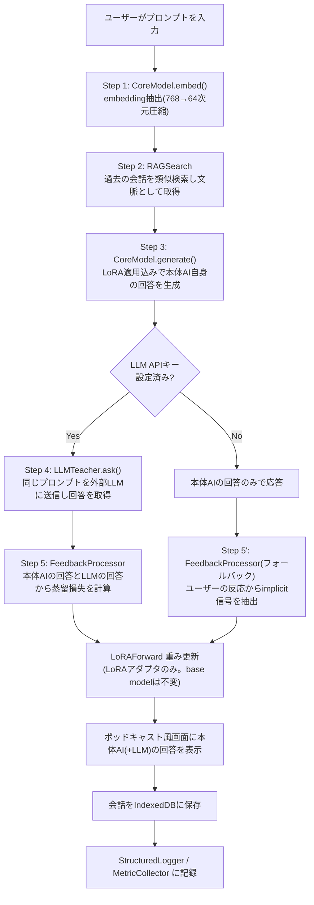

## 0. このドキュメントの位置づけ・改訂履歴

「賢い箱」は、ブラウザ内で完結する**極小の生成AI**(量子化済み・LoRA+RAG)を核とし、
ポッドキャストアプリ風の汎用UIをまとった、会話するたびに賢くなるアシスタントである。
外部LLM(ユーザーが任意でAPIキーを設定)を「先生役」として併用でき、その場合は
ユーザー・LLM・本体AI自身の三者の会話を使って本体AIを賢くしていく。

このドキュメントは3段階の改訂を経ている:

1. **初版**: Google Drive上の資料(`conversation-rag-app` フォルダ、00〜07)を統合。
   BERT+RAG+LoRAのアーキテクチャのみが決まっていて、ドメイン(何をするアプリか)は
   未決定だった。
2. **第2版**: ドメインを「パーソナル対話日記」と誤って推測し、応答を「過去エントリの
   提示・テンプレート質問・固定確認文」の3類型に限定、生成モデルを排除する設計にした。
   →ユーザーから「勝手に別のアプリになっている」と指摘され誤りと判明。
3. **本版(第3版)**: ユーザーとの対話で判明した正しいコンセプトに基づき全面改訂。
   - UI: ポッドキャストアプリ風の汎用デザイン(他アプリにも転用できる見た目)
   - 中身: 本体AI自身が量子化された小さな生成モデル+LoRA+RAGを持ち、会話するたびに
     賢くなる。外部LLM無しでも単体で動作する(自己完結)
   - 任意でLLM API連携: ユーザー・LLM・本体AIの三者の会話を使い、LLMの回答を
     教師信号としてLoRAを更新する(蒸留)
   - **本体AIの生の重みは絶対にファインチューニングしない**。フルファインチューニングは
     データ量的にもモデルが破綻するリスク的にも実用にならないため、常にLoRAアダプタ
     (数千パラメータ)のみを更新する。これはユーザーが明示した核心的な設計原則である。

---

## 1. コンセプト

### 1.1 何を作るか
「賢い箱」は、ポッドキャストアプリのような見た目を持つ、パーソナルな会話AIウィジェット
である。ユーザーが話しかける(テキスト入力)と、ブラウザ内で完結する極小の生成AI
(「本体AI」)が自分の言葉で答える。会話を重ねるほど、本体AIはLoRAとRAGの仕組みで
そのユーザーに合わせて賢くなっていく。

### 1.2 UIデザイン方針: ポッドキャスト風・汎用デザイン
見た目をポッドキャストアプリ風(カード型のエピソード表示、シンプルな再生/入力UI等)に
する理由は音声機能ではなく、**他のWebアプリにも転用できる汎用性の高いデザイン**にする
ためである。test001ハブの他アプリと同様、単一の`index.html`+αで完結するUIコンポーネント
として実装し、将来的に別アプリの「対話パーツ」として使い回せることを意図する。
音声入出力(録音・読み上げ)は現時点のスコープには含まない(将来拡張の余地として
第12節に記載)。

### 1.3 本体AIのアーキテクチャ原則(最重要)
- 本体AIは **1つの小型量子化生成モデル**(base model)を持つ。このモデルは
  「embedding抽出(RAG用)」と「文章生成(回答用)」の両方を兼ねる(BERT encoderと
  生成モデルを別々に持たない構成。「小さな小さな」重みという要望に沿う)。
- **base modelの重みは永久にfreezeし、一切更新しない。** 会話ごとの学習は、常に
  **LoRAアダプタ(数千パラメータ)のみ**に対して行う。
  - 理由(ユーザーの指摘そのもの): 極小モデルを実際の会話データでフルファイン
    チューニングすると、データ量的にもモデルが容易に破綻・崩壊し実用に耐えない。
    LoRAという小さな可逆的な変更に限定することで、システムを実用レベルに保つ。
  - 副次的な利点: LoRA重みは数KB程度なのでIndexedDBへの保存・複数ユーザー間の
    切り替えも軽量にできる。
- RAGは、本体AI自身のembeddingで過去の会話を検索し、生成時のコンテキストとして
  提供する(旧設計のRAG基盤をほぼそのまま流用できる)。

### 1.4 LLM連携: 三者会話による蒸留ループ(任意機能)
ユーザーが外部LLM(例: Claude API)のAPIキーを設定した場合、以下の三者会話ループが
追加で動く:

1. ユーザーがプロンプトを入力する
2. 本体AIが(LoRA適用込みで)自分の回答を生成する
3. 同じプロンプトを外部LLMにも送り、LLMの回答を得る
4. **ユーザーのプロンプト・LLMの回答・本体AI自身の回答**の3つを使い、損失
   (本体AIの回答をLLMの回答に近づける方向の教師あり損失。第5.6節参照)を計算する
5. その損失の勾配で、本体AIの **LoRAアダプタのみ** を1ステップ更新する(base modelは
   触らない。第1.3節の原則)

LLM APIキーが未設定の場合、本体AIは単体で回答を生成するのみで動作する(自己完結)。
この場合の学習信号は、旧設計から引き継いだimplicitフィードバック(質問への反応等)を
使う(第5.6節)。

**出口(画面表示・LLMへの送信)**:
- 本体AIの回答(および、LLM連携時はLLMの回答)をポッドキャスト風の画面に表示する
- LLM連携時は、ユーザーのプロンプト(および必要な文脈)をLLM APIへ送信する

---

## 2. システムアーキテクチャ

### 2.1 全体構成
```
CoreModel (量子化された小型生成モデル。embedding抽出+文章生成を兼ねる。base weightsはfreeze)
  + LoRA (数千パラメータのアダプタのみを学習対象とする)
  + RAG (CoreModelのembeddingで過去の会話を検索、64次元に圧縮)
  + LLMTeacher (任意。外部LLM APIを呼び、蒸留の教師信号を提供)
```

### 2.2 ターン処理フロー



### 2.3 モジュールと責務(一覧、全面改訂)

| モジュール | 責務 | 入力 | 出力 | 目標コスト |
|---|---|---|---|---|
| CoreModel | embedding抽出 **と** 文章生成の両方(base weightsはfreeze) | text, ragContext | embedding(64d), 生成テキスト | 生成 <1500ms(端末依存) |
| RAGSearch | 類似会話検索 | embedding | 類似ターン一覧, confidence | <20ms |
| IndexedDBManager | 会話・LoRA重み・LLM設定の永続化 | turnData | — | — |
| LLMTeacher | 任意。外部LLM APIの呼び出し | prompt, apiConfig | LLMの回答text | ネットワーク依存 |
| LoRAForward | CoreModelのquery/value等へのLoRA順伝播 | hiddenState + LoRA重み | 適応後の生成 | <1ms/層 |
| FeedbackProcessor | 蒸留損失(LLM連携時) / engagement信号(単体時)の算出 | own answer, llm answer?, user反応 | 学習ラベル・損失 | <50ms |
| TurnController | 全体オーケストレーション | userPrompt | 本体AI回答(+LLM回答) | 合計端末依存 |
| StructuredLogger | 構造化ログ記録 | turn/event data | ログ永続化(json/csv) | — |
| MetricCollector | メトリクス集計・目標値との比較 | ログ | 集計結果・アラート | — |
| ABTestRunner | バリアント割当・効果測定 | userId | variant, 記録 | — |

---

## 3. リポジトリ内フォルダ構成

```
docs/apps/smart-box/
├── DESIGN.md
├── README.md
├── package.json
├── .gitignore
├── configs/
│   ├── system.config.json
│   ├── rag.config.json
│   ├── llm.config.json        ← 新規: 外部LLM連携設定(APIキーはconfigに書かず、UIから
│   │                              入力しIndexedDB/localStorageにのみ保存する)
│   └── lora.config.json
├── src/
│   ├── modules/
│   │   ├── core-model/CoreModel.js         ← 旧 bert-inference/BERTInference.js を置換
│   │   ├── rag-search/RAGSearch.js, IndexedDBManager.js
│   │   ├── llm-teacher/LLMTeacher.js       ← 新規
│   │   ├── lora-training/LoRAForward.js, FeedbackProcessor.js
│   │   ├── turn-controller/TurnController.js
│   │   ├── logging/StructuredLogger.js, MetricCollector.js
│   │   └── experiments/ABTestRunner.js
│   └── ui/index.html, app.js, styles.css   ← ポッドキャスト風デザイン。Phase 1で実装
├── models/README.md
└── tests/unit/, tests/integration/
```

**変更点**: `question-generator/`(第2版で作った日記向け質問テンプレート一式)は本設計
では不要になったため削除する。質問駆動という概念自体は「本体AIが生成する回答の一部」に
吸収され、独立モジュールとしては持たない。`bert-inference/`は`core-model/`に置き換え、
`llm-teacher/`を新設する。

---

## 4. Config仕様

### 4.1 configs/system.config.json(改訂)
- モデル: CoreModelの量子化生成モデルへのURL(第8.1節、モデル候補は未確定)
- 実行環境: WebGPU優先、非対応時はwasm CPUにフォールバック
- ストレージ・ロギング・実験設定は旧版を維持

### 4.2 configs/rag.config.json
旧版とほぼ同じ(CoreModelのembeddingを使う点のみ変更、PCA圧縮・topK・閾値等は維持)

### 4.3 configs/llm.config.json(新規)
```json
{
  "enabled": false,
  "provider": "anthropic",
  "apiKeyStorage": "indexeddb-local-only",
  "model": "claude-...",
  "note": "APIキーはユーザーがUIから入力し、ブラウザのIndexedDB/localStorageにのみ保存する。configファイル自体にキーを書かない。サーバーには一切送信しない(本体AIとLLM APIへの直接呼び出しのみ)。"
}
```

### 4.4 configs/lora.config.json(改訂)
- 3階層(global/topic/style)のLoRA構成は維持
- **適用対象を「CoreModelの生成時のquery/value射影」に戻す**(第2版で「検索再ランキング
  のみ」に限定したのは誤りだった。本版では文章生成そのものにLoRAを適用する、本来の
  LoRAの使い方に戻す)
- 学習方式: 第1.4節の蒸留損失、またはengagementベースのimplicit信号。どちらも
  **LoRA行列のみ**を対象に更新する(base modelは不変)

---

## 5. モジュール設計詳細

### 5.1 CoreModel (`src/modules/core-model/CoreModel.js`)
- **責務**: 量子化された小型生成モデルをロードし、(a) embedding抽出、(b) LoRA適用込みの
  文章生成、の両方を行う。base weightsは常にfreeze。
- **主要API**:
  - `async initialize()`
  - `async embed(text): Promise<{embedding: Float32Array(64), rawEmbedding, latencyMs}>`
  - `async generate(prompt, ragContext, loraForward): Promise<{text: string, latencyMs}>`
    — LoRAForwardを注入し、生成の各層でLoRA補正を適用する
- **モデル候補(未確定・Phase 0で検証要)**: Qwen2.5-0.5B-Instruct級の小型多言語モデルを
  int4量子化し、`transformers.js`(WebGPU対応)または`onnxruntime-web`で実行する案を
  第一候補とする。日本語特化の超小型モデル(rinna/japanese-gpt2-small等)は指示追従性が
  低く、LLMとの蒸留の「教師との差分」を測る土台として力不足になる懸念があるため、
  多言語Instructモデルを優先する。実機でのロード時間・推論速度・メモリ使用量の検証が
  Phase 0のタスクとして必要(第8.1節)。

### 5.2 RAGSearch / IndexedDBManager
旧版とほぼ同じ。IndexedDBにLoRA重み・(暗号化はしないが)LLM APIキーの保存も担う。

### 5.3 LLMTeacher (`src/modules/llm-teacher/LLMTeacher.js`) — 新規
- **責務**: `llm.config.json`が`enabled: true`の場合のみ、ユーザーのプロンプトを外部LLM
  APIに送信し、回答を取得する。
- **主要API**: `async ask(prompt, ragContext): Promise<{text: string, latencyMs}>`
- **セキュリティ**: APIキーはブラウザのIndexedDB/localStorageにのみ保存し、賢い箱側の
  サーバー(存在しない)には一切送信しない。LLM APIへの呼び出しはブラウザから直接行う
  (CORS制約がある場合はユーザーに案内する)。

### 5.4 LoRAForward (`src/modules/lora-training/LoRAForward.js`) — 本来の役割に戻す
- **責務**: CoreModelの生成過程で、query/value射影にLoRAアダプタ`h' = h + (alpha/rank) * B * A * x`
  を適用する(第2版で「検索再ランキングのみ」に限定したのは誤りだったため撤回)。
- 3階層(global/topic/style)の意味は元の07セッションの定義に戻す:
  global=ユーザー全体の好み、topic=話題ごとの傾向、style=トーン、いずれもLoRAアダプタの
  みを更新対象とする。

### 5.5 FeedbackProcessor (`src/modules/lora-training/FeedbackProcessor.js`) — 蒸留損失を追加
- **責務**:
  1. **LLM連携時**: 本体AIの回答をLLMの回答に近づける教師あり損失(シーケンス生成の
     cross-entropy的な損失。LLMの回答文をターゲットとしたteacher-forcing)を計算する。
  2. **単体時**: 質問への反応等のimplicit signalから損失を計算する(旧設計を流用)。
- どちらの場合も、勾配の更新対象は**LoRAアダプタのみ**(第1.3節の原則)。

### 5.6 TurnController
第2.2節のフローをオーケストレーションする。`llm.config.json`の`enabled`フラグで
LLMTeacherを呼ぶかどうかを分岐する。

### 5.7〜5.9 StructuredLogger / MetricCollector / ABTestRunner
旧版とほぼ同じ。蒸留損失・engagementスコアをログ対象に追加。

---

## 6. データフロー: ターンごとの保存形式(改訂)

```json
{
  "turn_id": "turn_<timestamp>_<random>",
  "timestamp": "2026-09-19T10:30:00Z",
  "input": {
    "user_prompt": "...",
    "embedding": "[64-dim float32]"
  },
  "rag": {
    "retrieved_turns": 3,
    "top_similarities": [0.92, 0.85, 0.78]
  },
  "response": {
    "own_answer": "...",
    "llm_answer": "... | null",
    "llm_used": true
  },
  "learning": {
    "mode": "distillation | implicit",
    "loss_before": 0.45,
    "loss_after": 0.38
  }
}
```

---

## 7. IndexedDBスキーマ
旧版の`turns`/`metadata`/`logs`に加え、`metadata`ストアに以下を保持する:
- LoRA重み(A/B行列、3階層分)
- LLM APIキー・設定(`llm.config.json`のenabled/provider/model)

---

## 8. 技術的リスクと対応方針

### 8.1 ブラウザ内生成モデル + LoRA学習の実現可能性(最重要・未検証)
第2版まではBERT(encoder専用)前提だったため「LoRAは小さなスコアだけ動かす」という
軽い実装で済んでいたが、本版では**生成モデルの forward を通した誤差逆伝播**が必要になる。
これは以前の設計より技術的難度が上がる。対応方針:

- base modelは常にfreezeし、勾配計算・更新対象は**LoRAのA/B行列のみ**に限定する
  (第1.3節)。これにより、逆伝播自体は必要だが、更新対象のパラメータ数は数千のまま
  に抑えられる。
- 実装には、生成モデルのforwardを自動微分できるランタイムが必要(例:
  `onnxruntime-web`のtraining機能、または軽量な独自実装)。**この技術検証はPhase 0で
  最優先に行うべき未解決事項**であり、実現困難と判明した場合はPhase 2で
  「サーバーレスな疑似LoRA更新(例: 複数候補生成→LLMの回答に近い方を選好データとして
  蓄積し、まとめて少数ステップだけ更新する)」等の代替案を検討する。

### 8.2 モデル選定(第5.1節の候補は未検証)
Qwen2.5-0.5B-Instruct級モデルのブラウザ内(WebGPU/wasm)実行速度・メモリ・ロード時間の
実機検証がPhase 0のタスク。

### 8.3 LLM APIキーの扱い
ブラウザのIndexedDB/localStorageにのみ保存し、賢い箱側のサーバー(存在しない)には
送信しない。第三者(jsDelivr等)にも送信されない設計を徹底する。

### 8.4 蒸留損失の設計
LLMの回答文をそのままteacher-forcingのターゲットにする方式は実装可能だが、LLMの回答が
長い・本体AIの語彙やスタイルと乖離しすぎている場合、学習が不安定になるリスクがある。
Phase 1.5で実際のログを見ながら損失関数の重み付け・クリッピングを調整する。

---

## 9〜11節
テスト戦略・開発原則・フェーズロードマップの大枠は旧版を踏襲するが、Phase 0に
「生成モデル+LoRA逆伝播の技術検証」(第8.1節・8.2節)を最優先タスクとして追加する。

## 12. 次にやること(直近アクション、全面改訂)

1. **(最優先)** 生成モデル候補(第5.1節)の実機検証: ブラウザでロード・推論できるか、
   速度・メモリは許容範囲か
2. **(最優先)** LoRA部分のみを対象にした逆伝播が技術的に実現できるかの検証(第8.1節)
3. `CoreModel.js` の実装(embed + generate)
4. `LLMTeacher.js` の実装(LLM API呼び出し、APIキーのローカル保存UI含む)
5. `LoRAForward.js` / `FeedbackProcessor.js` の実装(蒸留損失・LoRA更新)
6. ポッドキャスト風UI(`src/ui/`)の実装
7. `TurnController` で結線し、Core loopを動かす
8. `docs/apps.json` への登録

(将来拡張として、音声入出力の追加も検討余地として残す。現時点のスコープ外)
