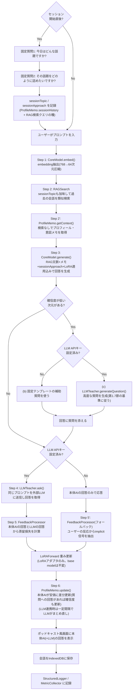

## 0. このドキュメントの位置づけ・改訂履歴

「賢い箱」は、ブラウザ内で完結する**極小の生成AI**(量子化済み・LoRA+RAG+プロフィール
メモ)を核とし、ポッドキャストアプリ風の汎用UIをまとった、会話するたびに賢くなる
アシスタントである。外部LLM(ユーザーが任意でAPIキーを設定)を「先生役」として併用でき、
その場合はユーザー・LLM・本体AI自身の三者の会話を使って本体AIを賢くしていく。

このドキュメントは8段階の改訂を経ている:

1. **初版**: Google Drive上の資料(`conversation-rag-app` フォルダ、00〜07)を統合。
   BERT+RAG+LoRAのアーキテクチャのみが決まっていて、ドメイン(何をするアプリか)は
   未決定だった。
2. **第2版**: ドメインを「パーソナル対話日記」と誤って推測し、応答を「過去エントリの
   提示・テンプレート質問・固定確認文」の3類型に限定、生成モデルを排除する設計にした。
   →ユーザーから「勝手に別のアプリになっている」と指摘され誤りと判明。
3. **第3版**: ユーザーとの対話で判明した正しいコンセプトに基づき全面改訂(生成モデル+
   LoRA+RAG、ポッドキャスト風UI、LLM任意連携による蒸留)。
4. **第4版**: 「賢くなる仕組み」の3本目の柱として、ユーザーのプロフィールや質問意図の
   傾向をAIが継続的にまとめる**プロフィール・意図メモ**を追加。RAGとは独立した軽量メモ
   として持つ設計にした(第1.5節)。
5. **第5版**: セッション開始時に固定で2問を尋ねる仕組みを追加。しかしこのとき、第4版の
   確信度ベースの質問機構を**誤って完全に削除してしまった**。
6. **第6版**: ユーザーから「確信度システムを効率が悪いとは言っていない。全てをRAG/LoRA
   という重い仕組みにせず軽くする、というのが元のコンセプトであり、確信度の仕組みを
   全部外せという意味ではない」という訂正を受け、第5版での削除を撤回。固定質問(a)と
   確信度ベースの補助質問(b)を併用する設計に戻した(第1.6節)。
7. **本版(第7版)**: ユーザーから「軽量な質問で得られる情報量をより効率的に設計すべき。
   質問の定型文そのものが重要で、より重要な質問をAIがするよう仕組む必要がある。LLM連携時
   はより高度な質問をさせ、より価値の高いメモ・RAGの材料を仕入れる仕組みにすべき。
   システムは、より純度の高い質問によって会話の質を高める構成であるべき」という指摘を
   受け、(1)質問の情報効率・純度を設計基準として明文化し(第1.7節)、(2)LLM連携時に
   質問文自体をLLMに生成させ高度化する第3の質問モード(c)を追加した(第1.8節)。
8. **第8版**: ユーザーから「小チビAI(本体AI)の実装は可能なのか」と問われ、
   第7版までの8.1節の「実現できるか未検証の研究課題」という書き方が不正確だったと
   判明。実際には推論(`transformers.js`/WebLLM)・LoRA学習(`onnxruntime-web`の
   training機能)ともに確立された実装手段があるため、「研究課題」から「具体的な
   ライブラリを使ったエンジニアリングタスク」に位置づけを訂正した(第5.1節・8.1節・
   8.2節)。
9. **本版(第9版)**: 実装・実機検証の過程で2点判明・変更した。(1) 開発サンドボックスの
   ネットワーク制限(huggingface.co/cdn.jsdelivr.netへのアクセス遮断)は、この開発環境
   固有の制約であり、実際にアプリを使うユーザーのブラウザには影響しない。つまり
   `transformers.js`がユーザーのブラウザから直接Hugging Faceにアクセスしてモデルを
   取得する通常の構成で、自前ホスティングは不要と判明した。(2) 当初「embedding抽出と
   文章生成を1モデルで兼ねる」としていたが、生成モデル(Qwen2.5-0.5B-Instruct、
   語彙15万・約512MB)をembeddingにも流用すると初回ダウンロードが重くなりすぎるため、
   embedding専用の軽量モデル(`Xenova/multilingual-e5-small`、日本語含む多言語対応・
   約118MB)に分離した。生成モデルとembeddingモデルは別々のONNXモデルとして
   `transformers.js`から個別に読み込む(第1.3節・5.1節・system.config.json参照)。
   LoRAによる学習対象は引き続き生成モデル側のみ。
10. **本版(第10版)**: 第9版の構成(生成512MB+embedding118MB=合計630MB)を、
    ユーザーのiPhone(Safari)で実機テストしたところ、**メモリ不足でタブが
    クラッシュを繰り返す**ことが判明した(Safariの「問題が繰り返し起きました」
    警告画面が表示された)。原因は、多言語対応モデルは語彙数(トークン数)が
    数十万規模と大きく、パラメータ数のわりに埋め込み層のサイズが大きくなること。
    ユーザーから「日本語特化の小型モデルを探す方が効率的では」と指摘され調査した
    が、(a) 日本語特化・小型のモデル(`rinna/japanese-gpt2-small`等)は指示
    チューニングされておらずONNX変換版もない、(b) 指示チューニング済みの日本語
    モデル(`rinna/japanese-gpt-neox-3.6b-instruction-sft`等)は3.6B〜4Bと
    ブラウザには大きすぎる、という理由で実用的な代替が見つからなかった。
    最終的に、Google公式の多言語(140言語以上)小型モデル`gemma-3-270m-it`を
    int4量子化(約322MB)で採用し、生成モデル+embeddingモデルの合計を約440MBまで
    削減した(第10版時点でこの構成も未検証。実機での再検証が次のステップ)。

---

## 1. コンセプト

### 1.1 何を作るか
「賢い箱」は、ポッドキャストアプリのような見た目を持つ、パーソナルな会話AIウィジェット
である。ユーザーが話しかける(テキスト入力)と、ブラウザ内で完結する極小の生成AI
(「本体AI」)が自分の言葉で答える。会話を重ねるほど、本体AIは**LoRA・RAG・プロフィール
メモ**という3つの仕組みで、そのユーザーに合わせて賢くなっていく。

### 1.2 UIデザイン方針: ポッドキャスト風・汎用デザイン
見た目をポッドキャストアプリ風(カード型のエピソード表示、シンプルな再生/入力UI等)に
する理由は音声機能ではなく、**他のWebアプリにも転用できる汎用性の高いデザイン**にする
ためである。test001ハブの他アプリと同様、単一の`index.html`+αで完結するUIコンポーネント
として実装し、将来的に別アプリの「対話パーツ」として使い回せることを意図する。
音声入出力(録音・読み上げ)は現時点のスコープには含まない(将来拡張の余地として
第12節に記載)。

「ポッドキャストのエピソード」というメタファーは見た目だけでなく、第1.6節の
セッション開始の固定質問という**機能面のメタファー**としても効いている。

### 1.3 本体AIのアーキテクチャ原則(最重要)
- 本体AIは **2つの小型量子化モデル**(いずれもbase model)を持つ:「文章生成(回答用)」
  を担う生成モデルと、「embedding抽出(RAG用)」を担う軽量embedding専用モデル。
  当初は1モデルで両方兼ねる設計だったが、第9版で分離した(1.3節末尾の注記参照)。
  いずれも「小さな小さな」重みという要望に沿う小型モデルである。
- **base modelの重みは(生成モデル・embeddingモデルともに)永久にfreezeし、一切
  更新しない。** 会話ごとの学習は、常に**生成モデル側のLoRAアダプタ(数千パラメータ)
  のみ**に対して行う。
  - 理由(ユーザーの指摘そのもの): 極小モデルを実際の会話データでフルファイン
    チューニングすると、データ量的にもモデルが容易に破綻・崩壊し実用に耐えない。
    LoRAという小さな可逆的な変更に限定することで、システムを実用レベルに保つ。
  - 副次的な利点: LoRA重みは数KB程度なのでIndexedDBへの保存・複数ユーザー間の
    切り替えも軽量にできる。
- RAGは、本体AI自身のembeddingで過去の会話を検索し、生成時のコンテキストとして
  提供する(旧設計のRAG基盤をほぼそのまま流用できる)。

### 1.4 LLM連携: 三者会話による蒸留ループ(任意機能)
ユーザーが外部LLM(例: Claude API)のAPIキーを設定した場合、以下の三者会話ループが
追加で動く:

1. ユーザーがプロンプトを入力する
2. 本体AIが(LoRA適用込みで)自分の回答を生成する
3. 同じプロンプトを外部LLMにも送り、LLMの回答を得る
4. **ユーザーのプロンプト・LLMの回答・本体AI自身の回答**の3つを使い、損失
   (本体AIの回答をLLMの回答に近づける方向の教師あり損失。第5.5節参照)を計算する
5. その損失の勾配で、本体AIの **LoRAアダプタのみ** を1ステップ更新する(base modelは
   触らない。第1.3節の原則)

LLM APIキーが未設定の場合、本体AIは単体で回答を生成するのみで動作する(自己完結)。
この場合の学習信号は、旧設計から引き継いだimplicitフィードバック(質問への反応等)を
使う(第5.5節)。

**出口(画面表示・LLMへの送信)**:
- 本体AIの回答(および、LLM連携時はLLMの回答)をポッドキャスト風の画面に表示する
- LLM連携時は、ユーザーのプロンプト(および必要な文脈)をLLM APIへ送信する

### 1.5 プロフィール・意図メモ(3本目の柱)
「賢くなる仕組み」はLoRA(生成スタイルの重み調整)とRAG(個別の過去ターンの検索)
だけでなく、**ユーザーの人物像(好み・専門性など)と、ユーザーが繰り返し尋ねる質問の
意図・傾向**を、AIが継続的に要約・更新していく**コンパクトなメモ**を3本目の柱として
持つ。この3本目の柱自体が「全てをRAG/LoRAという重い仕組みに通さず、軽く済ませる」
というコンセプトの体現であり(第0節・付録B参照)、第1.6節の質問機構は、どちらも
このProfileMemoという軽量な仕組みの中の手段である。

**RAGに含めない理由**: 「このユーザーはコード例を好む」「抽象論より具体例を求める傾向が
ある」といった情報は、特定の過去ターン1件を検索して思い出す類のものではなく、どの
ターンでも常に参照すべき静的な人物像である。これをRAGの検索対象に混ぜると、(a) 検索の
たびに埋め込み類似度計算のノイズになる、(b) 同じ情報が何度も別ターンとして重複保存され
肥大化する、という無駄が生じる。ユーザーの言う通り「ラグ(RAG)よりも効率的」に、
常に一定サイズの固定コンテキストとして直接注入する方が理にかなっている。

**メモの中身(例)**:
```json
{
  "profile": {
    "notes": ["技術的な話題を好む", "簡潔な説明を好み、長い前置きを嫌う", "..."],
    "confidence": { "formality": 0.8, "depth": 0.4, "exampleUsage": 0.6, "codeInclusion": 0.3 }
  },
  "questionIntentPatterns": [
    "デバッグ・具体的なコード修正についての質問が多い",
    "抽象的な概念より実例を伴う説明を求める傾向"
  ],
  "sessionHistory": [
    { "topic": "転職の相談", "approach": "選択肢を整理したい", "date": "2026-09-18" }
  ],
  "lastUpdated": "2026-09-19T10:00:00Z",
  "lastLlmConsolidation": "2026-09-19T09:00:00Z | null"
}
```

**更新の仕組み**(第1.6節の質問機構を含む):
- セッション開始時の固定質問(第1.6節a)への回答は`sessionHistory`に直接記録される
  (最も強く・最も安価な情報源。コールドスタートに強い)
- セッション途中、確信度が低い次元があれば補助質問(第1.6節b)を発火し、回答は
  `profile.confidence`の該当次元を更新する(固定質問だけでは拾えない細かい傾向を
  継続的に拾う)
- LLM連携時は、(b)の代わりにLLM生成の高度な質問(第1.8節c)を使うことがある
- 加えて、毎ターン、本体AI(CoreModel)自身が安価に「今回のやり取りでメモに追記・修正
  すべき点があるか」を短く生成し、`profile.notes`/`questionIntentPatterns`へ差分反映する
- LLM連携時は、一定ターン数ごと(`profile.config.json`の`llmConsolidationIntervalTurns`。
  既定20ターン)に、外部LLMを使ってメモ全体を整理・圧縮する「まとめ直し」を行う

### 1.6 質問機構: 固定質問(a) + 確信度ベースの補助質問(b)、併用
固定質問(a)と確信度ベースの補助質問(b)は役割が異なり、互いに代替できない
(第6版の訂正、付録B参照)。

**(a) セッション開始時の固定質問**
各セッション(ポッドキャストの「エピソード」に相当)の冒頭で、AIは固定の2問を尋ねる:
1. 「今日はどんな話題ですか?」 → `sessionTopic`として記録。RAGSearchの検索クエリの種、
   ProfileMemoの`sessionHistory`への記録に使う
2. 「その話題をどのように詰めたいですか?」 → `sessionApproach`として記録。このセッション
   中のCoreModel.generate()のスタイルに直接反映

**強み**: 安価・即座・会話1回目(履歴ゼロ)でも同じ強さの手がかりが得られる
(コールドスタートに強い)。**弱み**: 毎回同じ2問なので、固定質問がカバーしない細かい
次元(フォーマル度、コード例の要否等)は拾えない。

**(b) 確信度ベースの補助質問**
`ProfileMemo.profile.confidence`の各次元(`profile.config.json`の`trackedDimensions`:
formality, depth, exampleUsage, codeInclusion)のうち、閾値
(`confidenceThresholdForClarifyingQuestion`)未満のものがあれば、それを埋めるための
短い確認質問を本体AIの回答に添える。**強み**: セッションをまたいで継続的に、固定質問
だけでは拾えない粒度の情報を安く集められる。**弱み**: 確信度が閾値を超えるまで複数
ターンかかるため即効性は無い(だからこそ(a)と併用する意味がある)。頻度は
`profile.config.json`の`maxClarifyingQuestionsPerSession`で制御する。

**両者の関係**: (a)は「毎セッション必ず聞く、粗いが即効性のある2問」、(b)は
「必要な時だけ聞く、細かいが収束に時間がかかる補助質問」。どちらもRAG(検索)や
LoRA(重み学習)という重い仕組みを介さない、ProfileMemo内の軽量なテキストベースの
仕組みである点は共通する。(a)(b)いずれも第1.7節の質問設計原則に従う。

### 1.7 質問の質の設計原則(最重要・新規)
本体AIは小型モデルであり、流暢な文章で「賢さ」を演出することはできない。
**賢い箱が賢く見える主な源泉は、回答の巧拙ではなく「何を、どれだけ効率よく問うか」
である**(Socratic的アプローチ)。したがって、(a)(b)(c)いずれの質問も、その文面・
生成ロジックの質そのものが最重要の設計対象であり、場当たり的であってはならない。

**質問設計の基準**:
- **1問1次元**: 複数の意図を混ぜた曖昧な質問を避け、常に1つの具体的な不確実性を狙う
- **高情報利得**: 「はい/いいえ」で終わる質問より、回答の幅に応じて後続の判断
  (どのLoRA層を強めるか、どんな過去エントリを重視するか等)が変わる質問を優先する。
  Google Drive上の初期資料(00〜07)にあった`informationGain: prediction-gap`という
  考え方(意図分類の確信度を上げる質問を選ぶ)を、本版ではProfileMemoの各次元の
  不確実性を下げる質問選択という形で復活させる
- **純度**: 前置き無しで本質だけを聞く、短い質問文を徹底する。冗長な質問はそれ自体が
  ユーザー体験を損ない、「賢さ」の印象を損なう
- これらの基準は`profile.config.json`のテンプレート文言レビュー時、および第1.8節の
  LLM生成質問のプロンプト設計時の両方に適用する

### 1.8 LLM連携時の質問の高度化(新規、第3の質問モード)
LLM未接続時は(a)(b)ともに`profile.config.json`の固定テンプレートを使うが、LLM接続時は
LLMTeacherに質問文そのものを生成させる、第3の質問モード(c)を追加する。

**(c) LLM生成の高度な質問**(LLM連携時のみ)
固定テンプレートでは拾えない、文脈に応じた深い質問をLLMに考えさせる。目的は2つ:
1. ProfileMemoに書き込む価値の高い情報を、通常の(b)より踏み込んだ質問で引き出す
2. RAGに保存する価値の高い、要点の詰まったやり取りを意図的に生み出す(検索して
   後で役立つ「濃い」ターンを増やす)

(c)は(b)の発火条件(確信度が低い次元がある)をそのまま流用するが、質問文の生成元を
固定テンプレートからLLMTeacherに切り替える。LLM未接続時との「質問の質」の差は意図的な
設計であり、LLM接続への自然なインセンティブにもなる(第1.4節の蒸留機能に加え、
質問の質でも差別化する)。ただし(c)が生成する質問も第1.7節の設計基準(1問1次元・
高情報利得・純度)に従うよう、LLMTeacherへのプロンプトにこれらの基準を明示する。

---

## 2. システムアーキテクチャ

### 2.1 全体構成
```
CoreModel (量子化された小型モデル2つ。生成モデル+embedding専用モデル。base weightsはfreeze)
  + LoRA (数千パラメータのアダプタのみを学習対象とする)
  + RAG (CoreModelのembeddingで過去の会話を検索、64次元に圧縮)
  + ProfileMemo (ユーザー像・質問意図傾向の軽量な要約メモ。固定質問(a)+確信度ベース補助質問(b)
    +LLM連携時は高度化(c)の3モードを持つ。検索なしで常時コンテキストに注入)
  + LLMTeacher (任意。外部LLM APIを呼び、蒸留の教師信号 & メモのまとめ直し & 高度な質問生成を提供)
```

### 2.2 ターン処理フロー



### 2.3 モジュールと責務(一覧)

| モジュール | 責務 | 入力 | 出力 | 目標コスト |
|---|---|---|---|---|
| CoreModel | embedding抽出 **と** 文章生成の両方(base weightsはfreeze) | text, ragContext, profileContext | embedding(64d), 生成テキスト | 生成 <1500ms(端末依存) |
| RAGSearch | 類似会話検索 | embedding | 類似ターン一覧, confidence | <20ms |
| ProfileMemo | ユーザー像・質問意図傾向の要約メモの保持・差分更新、固定質問(a)+確信度ベース補助質問(b)の管理 | turnData, sessionTopic/Approach, (任意)LLM | プロフィール文脈, 補助質問候補 | 差分更新 <50ms |
| IndexedDBManager | 会話・LoRA重み・LLM設定・ProfileMemoの永続化 | turnData | — | — |
| LLMTeacher | 任意。外部LLM APIの呼び出し(蒸留・メモのまとめ直し・(c)高度な質問生成) | prompt, apiConfig | LLMの回答text, 質問text | ネットワーク依存 |
| LoRAForward | CoreModelのquery/value等へのLoRA順伝播 | hiddenState + LoRA重み | 適応後の生成 | <1ms/層 |
| FeedbackProcessor | 蒸留損失(LLM連携時) / engagement信号(単体時)の算出 | own answer, llm answer?, user反応 | 学習ラベル・損失 | <50ms |
| TurnController | 全体オーケストレーション(質問機構(a)(b)(c)の切り替えを含む) | userPrompt | 本体AI回答(+LLM回答) | 合計端末依存 |
| StructuredLogger | 構造化ログ記録 | turn/event data | ログ永続化(json/csv) | — |
| MetricCollector | メトリクス集計・目標値との比較 | ログ | 集計結果・アラート | — |
| ABTestRunner | バリアント割当・効果測定 | userId | variant, 記録 | — |

---

## 3. リポジトリ内フォルダ構成

```
docs/apps/smart-box/
├── DESIGN.md
├── README.md
├── package.json
├── .gitignore
├── configs/
│   ├── system.config.json
│   ├── rag.config.json
│   ├── profile.config.json    ← 固定質問テンプレート + 確信度ベース補助質問の閾値・頻度
│   ├── llm.config.json        ← 外部LLM連携設定(APIキーはconfigに書かず、UIから
│   │                              入力しIndexedDB/localStorageにのみ保存する)
│   └── lora.config.json
├── src/
│   ├── modules/
│   │   ├── core-model/CoreModel.js
│   │   ├── rag-search/RAGSearch.js, IndexedDBManager.js
│   │   ├── profile-memo/ProfileMemo.js
│   │   ├── llm-teacher/LLMTeacher.js
│   │   ├── lora-training/LoRAForward.js, FeedbackProcessor.js
│   │   ├── turn-controller/TurnController.js
│   │   ├── logging/StructuredLogger.js, MetricCollector.js
│   │   └── experiments/ABTestRunner.js
│   └── ui/index.html, app.js, styles.css   ← ポッドキャスト風デザイン。Phase 1で実装
├── models/README.md
└── tests/unit/, tests/integration/
```

---

## 4. Config仕様

### 4.1 configs/system.config.json
- モデル: CoreModelの量子化生成モデルへのURL(第8.1節、モデル候補は未確定)
- 実行環境: WebGPU優先、非対応時はwasm CPUにフォールバック
- ストレージ・ロギング・実験設定は旧版を維持

### 4.2 configs/rag.config.json
CoreModelのembeddingを使う(PCA圧縮・topK・閾値等は維持)。ProfileMemoの情報は
含めない(第1.5節の理由により意図的に分離)。

### 4.3 configs/profile.config.json
```json
{
  "sessionOpeningQuestions": {
    "topic": "今日はどんな話題ですか?",
    "approach": "その話題をどのように詰めたいですか?"
  },
  "updateEveryTurn": true,
  "llmConsolidationIntervalTurns": 20,
  "trackedDimensions": ["formality", "depth", "exampleUsage", "codeInclusion"],
  "confidenceThresholdForClarifyingQuestion": 0.4,
  "maxClarifyingQuestionsPerSession": 3,
  "questionDesignPrinciples": {
    "onePerQuestion": "1問につき1つの不確実な次元だけを狙う",
    "highInformationGain": "後続の判断が変わる質問を優先する(prediction-gapの考え方)",
    "purity": "前置き無しで本質だけを聞く、短い質問文にする"
  },
  "note": "DESIGN.md 1.6〜1.8節を参照。(a)固定質問・(b)確信度ベース補助質問・(c)LLM連携時の高度化質問の3モードがある。questionDesignPrinciplesは(a)(b)のテンプレート文言レビューと(c)のLLMプロンプト設計の両方に適用する共通基準(第7版で追加)。"
}
```

### 4.4 configs/llm.config.json
```json
{
  "enabled": false,
  "provider": "anthropic",
  "apiKeyStorage": "indexeddb-local-only",
  "model": "claude-...",
  "note": "APIキーはユーザーがUIから入力し、ブラウザのIndexedDB/localStorageにのみ保存する。configファイル自体にキーを書かない。サーバーには一切送信しない。蒸留(第1.4節)・ProfileMemoのまとめ直し(第1.5節)・(c)高度な質問生成(第1.8節)の3つでLLMを使う。"
}
```

### 4.5 configs/lora.config.json
- 3階層(global/topic/style)のLoRA構成を維持
- 適用対象は「CoreModelの生成時のquery/value射影」(本来のLoRAの使い方)
- 学習方式: 第1.4節の蒸留損失、またはengagementベースのimplicit信号。どちらも
  **LoRA行列のみ**を対象に更新する(base modelは不変)
- ProfileMemoの更新はLoRAの学習対象ではない(重みではなくテキスト/構造化データの
  差分更新であり、別の軽量な仕組み。第5.3節参照)

---

## 5. モジュール設計詳細

### 5.1 CoreModel (`src/modules/core-model/CoreModel.js`)
- **責務**: 量子化された小型モデル2つ(生成モデル・embedding専用モデル)をロードし、
  (a) embedding抽出、(b) LoRA適用込みの文章生成、を行う。base weightsは常にfreeze。
- **主要API**:
  - `async initialize()`
  - `async embed(text): Promise<{embedding: Float32Array(64), rawEmbedding, latencyMs}>`
  - `async generate(prompt, ragContext, profileContext, loraForward): Promise<{text: string, latencyMs}>`
    — RAG文脈とProfileMemoの文脈の両方を入力し、LoRAForwardを注入して生成の各層で
    LoRA補正を適用する
  - `async summarizeForProfile(turnData): Promise<{ profileDelta: object }>` —
    毎ターンの安価な差分更新用に、CoreModel自身で短い要約を生成する(ProfileMemoから
    呼ばれる)
- **実装基盤(第8版で確定・第9版でモデル分離・第10版で生成モデル変更)**:
  推論(embed/generate)は**transformers.js**(Hugging Face製、WebGPU対応)を使う。
  feature-extractionパイプラインとtext-generationパイプラインを、それぞれ別の
  モデルインスタンスに対して使う(第9版で1モデル兼用から分離)。生成モデルは
  `gemma-3-270m-it`のONNX変換版(int4量子化・約322MB、`system.config.json`の
  `model.coreModelUrl`、第10版でQwen2.5-0.5B-Instructから変更)、embeddingモデルは
  `multilingual-e5-small`のONNX変換版(約118MB、日本語含む多言語対応、
  `model.embeddingModelUrl`)。いずれもHugging Face上の既存の変換済みリポジトリを
  ユーザーのブラウザが直接参照する(第8.2節)。
- **LoRA学習の実装基盤**: **ONNX Runtime Web の training機能**
  (`onnxruntime-web`のtraining版、`onnxruntime-training-web`)を使う。LoRAのA/B行列
  だけをtrainableに指定した学習用ONNXグラフ(training artifact)をブラウザ内でロードし、
  forward→backward→optimizer stepを実行できる。この学習用グラフ自体は、モデル準備段階で
  Python側(`onnxruntime.training`のツール)を使い**開発時に1回だけ**エクスポートして
  おく(ユーザーの端末上で毎回行う作業ではない)。詳細は第8.1節を参照。

### 5.2 RAGSearch / IndexedDBManager
- RAGSearchはembedding類似検索(旧版と同じ)。sessionTopicをクエリの種として使える
- IndexedDBManagerは会話・LoRA重み・LLM設定に加え、`metadata`ストアに
  ProfileMemoのドキュメント(第1.5節のJSON)も保持する

### 5.3 ProfileMemo (`src/modules/profile-memo/ProfileMemo.js`)
- **責務**: ユーザーの人物像と質問意図の傾向を要約したメモ(第1.5節)を保持・更新する。
  RAGとは独立した、検索を伴わない常時参照コンテキスト。第1.6節の(a)(b)の結果もここに
  記録する。
- **主要API**:
  - `async getContext(): Promise<string>` — CoreModel.generate()に渡す、現在のメモの
    テキスト表現を返す(固定サイズに収まるよう要約済みであること)
  - `async recordSessionOpening(sessionTopic, sessionApproach): Promise<void>` —
    (a)固定質問2問への回答を`sessionHistory`に記録する
  - `getLowConfidenceDimensions(): string[]` — (b)(c)共通で使う。確信度が
    `confidenceThresholdForClarifyingQuestion`未満の次元を返す
  - `async recordConfidenceAnswer(dimension, answer): Promise<void>` — (b)(c)いずれの
    質問への回答も、このメソッドで`profile.confidence`の該当次元に反映する
  - `async update(turnData, coreModel): Promise<void>` — 毎ターン、CoreModelの軽量な
    要約(`CoreModel.summarizeForProfile()`)を使ってメモに差分反映する
  - `async consolidateWithLLM(llmTeacher): Promise<void>` —
    `profile.config.json`の`llmConsolidationIntervalTurns`ごとに呼ばれ、外部LLMで
    メモ全体を整理・圧縮する(LLM連携時のみ)
- **永続化**: IndexedDBManagerの`metadata`ストアに1ドキュメントとして保存。

### 5.4 LLMTeacher (`src/modules/llm-teacher/LLMTeacher.js`)
- **責務**: `llm.config.json`が`enabled: true`の場合のみ、(1) ユーザーのプロンプトを
  外部LLM APIに送信し回答を取得する(蒸留用)、(2) ProfileMemoのまとめ直しを依頼する、
  (3) **(c) 第1.7節の設計基準に従った高度な質問を生成する**、の3つの役割を持つ
  (第7版で(3)を追加)。
- **主要API**:
  - `async ask(prompt, ragContext): Promise<{text: string, latencyMs}>`
  - `async consolidateProfile(currentMemo, recentTurns): Promise<{ consolidatedMemo: object }>`
  - `async generateQuestion(dimension, profileContext, ragContext): Promise<{ text: string, latencyMs }>` —
    (c) 対象次元(dimension)を埋めるための、ProfileMemo/RAGに価値の高い情報をもたらす
    質問を生成する。プロンプトには第1.7節の設計基準(1問1次元・高情報利得・純度)を
    明示的に含める
- **セキュリティ**: APIキーはブラウザのIndexedDB/localStorageにのみ保存し、サーバー
  (存在しない)や第三者には一切送信しない。

### 5.5 LoRAForward / FeedbackProcessor
(変更なし。CoreModelのquery/value射影へのLoRA適用、蒸留損失/implicit損失の算出。
ProfileMemoの更新とは独立した仕組みである点に注意)

### 5.6 TurnController
- セッションの最初のユーザー操作時、(a)固定質問2問を発火し、回答を
  `ProfileMemo.recordSessionOpening()`に渡す
- 通常ターンの生成後、`ProfileMemo.getLowConfidenceDimensions()`を確認し、対象があれば
  LLM接続済みなら(c) `LLMTeacher.generateQuestion()`、未接続なら(b)固定テンプレートの
  いずれかで補助質問を回答に添える(頻度制御あり)
- 以降は第2.2節の通常フロー(RAG検索とProfileMemo取得を両方行い、生成後にLoRA更新と
  ProfileMemo更新を両方行う)をオーケストレーションする

### 5.7〜5.9 StructuredLogger / MetricCollector / ABTestRunner
(変更なし。(a)(b)(c)いずれの質問についても発火率・回答率・(c)の場合はLLM生成かどうかを
ログ対象に加える)

---

## 6. データフロー: ターンごとの保存形式

```json
{
  "turn_id": "turn_<timestamp>_<random>",
  "session_id": "session_<timestamp>",
  "is_session_opening": false,
  "timestamp": "2026-09-19T10:30:00Z",
  "input": {
    "user_prompt": "...",
    "embedding": "[64-dim float32]"
  },
  "rag": {
    "retrieved_turns": 3,
    "top_similarities": [0.92, 0.85, 0.78]
  },
  "profile_memo": {
    "context_used": "...(getContext()のスナップショット)",
    "updated_this_turn": true,
    "llm_consolidated_this_turn": false,
    "clarifying_question": { "dimension": "codeInclusion", "text": "...", "source": "template | llm" }
  },
  "response": {
    "own_answer": "...",
    "llm_answer": "... | null",
    "llm_used": true
  },
  "learning": {
    "mode": "distillation | implicit",
    "loss_before": 0.45,
    "loss_after": 0.38
  }
}
```

セッション開始時の固定質問2問は、`is_session_opening: true`の専用ターンとして記録し、
その回答(`sessionTopic`/`sessionApproach`)は`profile_memo`セクションではなく
`ProfileMemo.sessionHistory`(第1.5節)に直接記録する。`clarifying_question.source`で
テンプレート由来(b)かLLM生成(c)かを区別する。

---

## 7. IndexedDBスキーマ
`turns`/`metadata`/`logs`の3ストア構成。`metadata`ストアに以下を保持する:
- LoRA重み(A/B行列、3階層分)
- LLM APIキー・設定
- ProfileMemoドキュメント(第1.5節のJSON。`sessionHistory`と`profile.confidence`を含む。
  1ユーザー1件)

---

## 8. 技術的リスクと対応方針

### 8.1 ブラウザ内生成モデル + LoRA学習の実現可能性(第8版で再評価: 実現手段あり)
**旧版の訂正**: 第7版まで「実現できるか未検証の研究課題」という悲観的な書き方をして
いたが、これは不正確だった。実際には確立された手段がある:

- **推論(embed/generate)**: `transformers.js`や`WebLLM`(MLC-AI)等、ブラウザで
  小型量子化モデルをWebGPU実行するライブラリは既に実用段階にあり、Qwen2.5-0.5B級の
  モデルを動かすこと自体は目新しい研究課題ではない(第5.1節)。
- **LoRA学習**: `onnxruntime-web`のtraining機能を使えば、LoRAのA/B行列だけを
  trainableに指定した学習用グラフをブラウザ内でforward→backward→重み更新できる
  (第5.1節)。base modelは常にfreezeし、勾配計算・更新対象は**LoRAのA/B行列のみ**に
  限定する(第1.3節)という設計は、この仕組みとそのまま合致する。

**残る実装タスク(研究課題ではなくエンジニアリングタスク)**:
1. 選定したモデル+LoRA構成(第4.5節の3階層)に対し、Python側で
   `onnxruntime.training`を使った学習用グラフ(training artifact)を実際に
   エクスポートできるか試す(モデル準備段階の1回きりの作業)
2. エクスポートしたartifactを`onnxruntime-web` training版でブラウザ内ロードし、
   実際にforward→backward→重み更新の1サイクルが動くことを確認する
3. 精度・速度がPhase 1の目標値(第4.1節)に収まるか実機計測する

これらはPhase 0で着手し、うまくいかない場合のみ第7版までの記述にあった代替案
(候補生成→選好データとして蓄積→バッチ更新)を検討する。

**Phase 0スパイクの実施結果(`docs/apps/smart-box/research/`、2026-09-19)**: 上記タスク1・2
のメカニズムをPythonで実際に検証した。ただし、このセッションの開発環境は
`huggingface.co`(モデルのダウンロード元)へのネットワークアクセスが組織ポリシーで
遮断されており、実際のQwen2.5-0.5B-Instructモデルは取得できなかった。そのため、
CoreModel+LoRAForwardと同じ構造(frozen base forward + LoRA A/B残差)を持つ**最小の
ダミーONNXモデル**でメカニズムを検証した:

- `onnxruntime.training.artifacts.generate_artifacts(model, requires_grad=["LoRA_A","LoRA_B"], frozen_params=["W0"], loss=MSELoss, optimizer=AdamW)`
  で学習用artifact(training/eval/optimizer/checkpoint)の生成に成功
- `onnxruntime.training.api`(`Module`/`Optimizer`/`CheckpointState`)でartifactをロードし、
  実際に5ステップの学習ループを実行 → **lossが単調減少し、LoRA_A/LoRA_Bの値が実際に
  変化することを確認**。base weights(W0)はそもそも学習対象のパラメータ集合に含まれず、
  「更新されようがない」ことがAPIレベルで保証されていることも確認した

これにより、DESIGN.md 1.3節の核心原則(base modelはfreeze、LoRAのA/B行列のみ学習)が
実際に機能するメカニズムであることが、縮小版ではあるが実証された。**残っているのは
「実際のQwenモデルに同じ手順を適用する」という、ネットワークアクセスさえあれば
遂行できる作業**であり、研究課題ではなく、環境制約の解消待ちの実装タスクである。
詳細は`docs/apps/smart-box/research/README.md`を参照。

### 8.2 モデル選定
Qwen2.5-0.5B-Instruct級モデルのONNXエクスポート(int4量子化)版が公開されているか、
無ければ自前でエクスポートする必要がある。ブラウザ内(WebGPU/wasm)実行速度・メモリ・
ロード時間、および第8.1節の学習用グラフのエクスポート可否の実機検証がPhase 0のタスク。

**環境制約**: このセッションのサンドボックスからは`huggingface.co`にアクセスできず、
実モデルでの検証は実施できていない(第8.1節参照)。huggingface.coへのアクセスが
許可された環境(別セッション、またはユーザーの手元環境)で、`docs/apps/smart-box/research/`
のスパイクスクリプトと同じ手順を実際のモデルに適用する必要がある。

### 8.3 LLM APIキーの扱い
ブラウザのIndexedDB/localStorageにのみ保存し、サーバー(存在しない)には送信しない。

### 8.4 蒸留損失の設計
LLMの回答文をteacher-forcingのターゲットにする方式は実装可能だが、学習の安定性は
Phase 1.5で実ログを見ながら調整する。

### 8.5 ProfileMemoの肥大化・陳腐化リスク
毎ターンの差分更新だけを続けると、メモが冗長化・矛盾を含むようになるおそれがある。
LLM連携時の定期的な「まとめ直し」(第1.5節)はこれを防ぐ主な対策。セッション開始の
固定質問による`sessionHistory`、確信度ベース補助質問による`profile.confidence`は
どちらも構造化されているため、この肥大化リスクの影響を受けにくい。

### 8.6 質問の質の評価方法(新規)
第1.7節の設計基準(1問1次元・高情報利得・純度)を満たしているかどうかは、主観的な
判断が入りやすい。Phase 1.5で、(a)(b)(c)それぞれの質問についてengagementScore
(質問後にユーザーがどれだけ具体的に応答したか)を計測し、基準を満たさない低品質な
テンプレート・LLMプロンプトを特定して改善するサイクルを回す。

---

## 9〜11節
テスト戦略・開発原則・フェーズロードマップの大枠は第3版を踏襲する。Phase 1のスコープに
(a)(b)の質問機構を含め、(c)LLM生成の高度な質問はLLM連携そのものと合わせてPhase 1.5〜2で
評価する。

## 12. 次にやること(直近アクション)

1. **(最優先)** モデル準備: Qwen2.5-0.5B-Instruct級モデルのONNX(int4量子化)版を
   用意し、`onnxruntime.training`でLoRA学習用グラフをエクスポートできるか試す
   (第8.1節・8.2節。研究課題ではなくエンジニアリングタスクとして着手する)
2. **(最優先)** `transformers.js`でモデルをロードし、embed/generateの実機動作・速度を
   確認する(第5.1節)
3. `CoreModel.js` の実装(embed + generate + summarizeForProfile。transformers.js基盤)
4. `ProfileMemo.js` の実装((a)固定質問の記録 + (b)確信度ベース補助質問 + 毎ターンの
   差分更新。LLMまとめ直し・(c)はPhase 2)
5. `LLMTeacher.js` の実装(蒸留・ProfileMemoまとめ直し・(c)高度な質問生成・APIキーの
   ローカル保存UI)
6. `LoRAForward.js` / `FeedbackProcessor.js` の実装(蒸留損失・LoRA更新)
7. ポッドキャスト風UI(`src/ui/`)の実装(固定質問2問の画面・補助質問の表示を含む)
8. `TurnController` で結線し、Core loopを動かす
9. **(a)(b)の質問テンプレート文言を、第1.7節の設計基準(1問1次元・高情報利得・純度)に
   照らして実際にレビューする**(現在のテンプレートは初期案であり、レビュー未実施)
10. `docs/apps.json` への登録

(将来拡張として、音声入出力の追加も検討余地として残す。現時点のスコープ外)

---

## 付録B: 第5版での削除とその撤回(2026-09-19)

第5版で「セッション開始の固定質問2問」を導入した際、第4版の確信度ベースの補助質問を
「複雑で非効率」と判断して完全に削除してしまった。しかしユーザーからの訂正:「確信度の
システムは効率が悪いのか?別の良さがある。全てをRAGとLoRAにせず軽くすると言うコンセプト
だった。全てを外せとは言っていない」を受け、これは誤りだったと判明した。

正しい理解: ProfileMemoという3本目の柱そのものが「RAG(検索)やLoRA(重み学習)という
重い仕組みに全てを頼らず、軽量な手段も併用する」というコンセプトの実装であり、固定質問と
確信度ベース補助質問は、その軽量な手段の中の2つの具体的な手法として共存すべきものだった。
第6版でこれを訂正し、両方を採用する設計に戻した(第1.6節)。

## 付録C: 質問の質を核とした設計への発展(第7版、2026-09-19)

ユーザーから「質問の定型文そのものが重要」「LLM接続時はより高度な質問で、より価値の
高いメモ・RAGの材料を仕入れる仕組みにすべき」「純度の高い質問で会話の質を高める構成が
重要」という指摘を受けた。これは単なる機能追加ではなく、**「賢い箱の賢さは回答ではなく
質問から生まれる」という製品の中心的な価値観**を明確化するものであり、第1.7節・1.8節・
8.6節として設計原則に格上げした。Google Drive初期資料にあった「質問駆動型」という
コンセプト(00_README.mdのビジョン)を、応答生成に絡めた複雑な形(第1〜2版で試みて
失敗)ではなく、ProfileMemoという軽量な仕組みの中の質問品質という、より具体的で
実装可能な形で回収したことになる。
