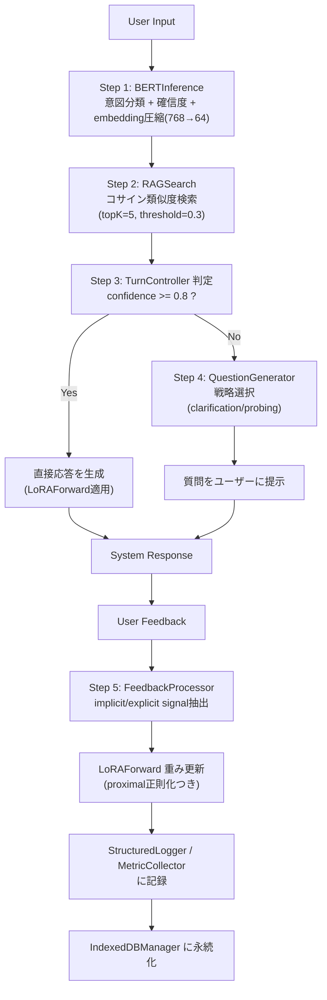

## 0. このドキュメントの位置づけ

「賢い箱」は、Claude Cowork(クラウドセッション)で先行して設計された `conversation-rag-app` ―
ユーザーとの会話を通じてその人固有の好みを学習していく、ブラウザ完結型の会話AIアシスタント
の開発コードネームである。

設計資料はGoogle Drive上に `conversation-rag-app` フォルダとして8本(`00_README.md` 〜
`07_COWORK_SESSION_HANDOFF.md`)保存されている。本ドキュメントはそれらを1本に統合し、
このリポジトリ(test001のアプリハブ)内で実装を継続するための正本(Single Source of Truth)
として作成した。

**重要な前提の変更**: 当初 `seisei001/conversation-rag-app` という独立リポジトリを作る想定
だったが、そのリポジトリは実際には存在せず、Coworkセッションもこのセッションもアクセス権限
を持っていなかった。ユーザーの指示により、実装場所を **test001アプリハブ内のサブアプリ**
(`docs/apps/smart-box/`)に変更した。フォルダ構成・configはこの前提で読み替えてある。

**Config正本の優先順位**: `04_CONFIG_TEMPLATES.md`(9/18付、設計初期のドラフト)と
`07_COWORK_SESSION_HANDOFF.md`(9/19付、直近のCoworkセッションでの最終決定)とで数値に
食い違いがある。**本設計書および実装は07を正とする**(日付が新しく、「決定」と明記されている
ため)。差分は付録Aに記録した。

---

## 1. コンセプト

### 1.1 ビジョン
ユーザーとの会話を通じて、その人固有の好み(技術的な深さ、フォーマルさ、例の多さ、コードの
有無など)を学習していくWeb AIアシスタント。学習は全てブラウザ内で完結し、外部APIへの通信は
発生しない(=完全無料、プライバシー保持)。

### 1.2 特徴
| 特徴 | 内容 |
|---|---|
| 軽量BERT | `bert-base-japanese` を int8量子化・ONNX化(約30MB)、ブラウザで推論のみ実行 |
| 質問駆動型RAG | 768→64次元に圧縮したembeddingで、過去の会話ターンを類似検索(<20ms目標) |
| 多次元LoRA | global/topic/style の3階層アダプタ(合計約7,000パラメータ、7KB)でパーソナライズ |
| 速度重視 | 1ターンあたり合計 <1000ms(デスクトップ目標は詳細メトリクス参照) |
| 完全無料 | サーバー不要。GitHub Pages配信 + jsDelivr CDN経由でモデル配信 |

### 1.3 設計の核心(3つの柱)
1. **質問が全てを駆動する** — 確信度が低い時は戦略的に質問し、高品質な学習信号を引き出す
2. **軽量RAG** — フルテキストではなく64次元embeddingのパターンのみを記録し、O(N)コサイン
   類似度検索で十分な速度を出す
3. **反復改良フレンドリー** — 全てconfig駆動(ハードコード禁止)。A/Bテストが標準搭載

---

## 2. システムアーキテクチャ

### 2.1 全体構成
```
BERT-base-japanese (凍結・推論のみ)
  + RAG (64-dim embedding, ローカルインデックス)
  + LoRA (3階層, 合計約7,000パラメータ)
  + User Model (好みベクトル)
```

### 2.2 ターン処理フロー



### 2.3 モジュールと責務(一覧)

| モジュール | 責務 | 入力 | 出力 | 目標コスト |
|---|---|---|---|---|
| BERTInference | 意図分類・embedding抽出 | text | intent, confidence, embedding(64d) | 推論 <500ms |
| RAGSearch | 類似ターン検索 | embedding | 類似ターン一覧 | <20ms |
| IndexedDBManager | ターン永続化・CRUD | turnData | — | — |
| QuestionGenerator + strategies | 質問生成 | intent, confidence | question text or null | <5ms |
| LoRAForward | ユーザー適応の順伝播 | embedding + LoRA重み | 適応後出力 | <1ms |
| FeedbackProcessor | フィードバック信号抽出 | user feedback | preference delta, 学習ラベル | <5ms |
| TurnController | 全体オーケストレーション | user_input | response or question | 合計 <1000ms |
| StructuredLogger | 構造化ログ記録 | turn/event data | ログ永続化(json/csv) | — |
| MetricCollector | メトリクス集計・目標値との比較 | ログ | 集計結果・アラート | — |
| ABTestRunner | バリアント割当・効果測定 | userId | variant, 記録 | — |

---

## 3. リポジトリ内フォルダ構成

test001は「アプリハブ」(`docs/apps/<id>/` にミニアプリを追加していく構成)のため、
「賢い箱」は `docs/apps/smart-box/` 以下に、独立プロジェクトとして完結する形で配置する。

```
docs/apps/smart-box/
├── DESIGN.md                 ← 本ファイル(詳細設計書)
├── README.md                 ← クイックスタート・進め方
├── package.json              ← 開発時のみ使用(テストランナー等。本番は無ビルド)
├── .gitignore
├── configs/
│   ├── system.config.json
│   ├── rag.config.json
│   ├── question.config.json
│   └── lora.config.json
├── src/
│   ├── modules/
│   │   ├── bert-inference/BERTInference.js
│   │   ├── rag-search/RAGSearch.js, IndexedDBManager.js
│   │   ├── question-generator/QuestionGenerator.js
│   │   │   └── strategies/Strategy.js, direct.js, contrastive.js,
│   │   │                  clarification.js, probing.js
│   │   ├── lora-training/LoRAForward.js, FeedbackProcessor.js
│   │   ├── turn-controller/TurnController.js
│   │   ├── logging/StructuredLogger.js, MetricCollector.js
│   │   └── experiments/ABTestRunner.js
│   └── ui/index.html, app.js, styles.css   ← Phase 1で実装(現時点では未作成)
├── models/README.md          ← ONNXモデルの配置方法(CDN配信、リポジトリに同梱しない)
└── tests/unit/, tests/integration/
```

**test001の他アプリとの違い**: `hello` や `url-viewer` は単一HTMLで完結する軽量アプリだが、
「賢い箱」は本格的なモジュール構成を持つため、`avatar`アプリ(lib/・animations/・models/を
持つ)と同様に、フォルダ構成を持つ「重い」ミニアプリとして扱う。

**モジュール形式の変更**: 元設計(05_CODE_TEMPLATES.md)はCommonJS(`require`/
`module.exports`)を前提にしていたが、test001の他アプリは全てビルド無し・ブラウザネイティブ
ESM + import map(CDN)方式を採用している。本設計ではこれに合わせ、**全モジュールをネイティブ
ESM(`export class` / `export default`)に変更**する。`onnxruntime-web` 等の外部依存は
`index.html` 内の import map でjsDelivrから読み込む(`avatar`アプリの three.js と同じ方式)。

**ハブへの登録タイミング**: 現時点ではモジュールは全てJSDocインターフェースのみのスタブで
あり、動作するUIが無い。`docs/apps.json` への登録(ハブ一覧への表示)は、Phase 1 MVP
(チャットUIが動作する状態)が完成してから行う。それまでは `docs/apps/smart-box/` は存在
するがハブには表示されない「開発中」フォルダとして扱う。

---

## 4. Config仕様(正本)

以下は `07_COWORK_SESSION_HANDOFF.md` で確定した最終版そのもの(スキーマURLのパスのみ
`docs/apps/smart-box/` 配下に合わせて相対化)。

### 4.1 configs/system.config.json
- モデル: `bert-base-ja-int8.onnx`(int8量子化、期待サイズ30MB)、`maxSequenceLength: 128`
- 実行環境: wasmバックエンド、4スレッド、ロード時ウォームアップあり
- ストレージ: IndexedDB `conversation-rag-db`、最大1000ターン保存、100ターンごとに圧縮、
  容量警告40MB/上限80MB
- ロギング: 有効、`info`レベル、IndexedDBへも永続化、json/csvエクスポート対応
- 実験: A/Bテスト有効、sticky assignment(同一ユーザーは常に同じバリアント)
- 目標値: 推論 <500ms、ターン合計 <1000ms、意図分類精度 >=0.85、entity F1 >=0.70、
  文脈理解 >=0.70

### 4.2 configs/rag.config.json
- embedding: 768→64次元にPCA固定射影で圧縮。PCA行列は日本語コーパス(JGLUE系)から
  オフラインで1回だけfitし、静的アセットとして配布(モデル更新時のみ再計算)
- 決定理由: コールドスタート問題の回避。RAGは補助的役割のため中程度の精度要求で十分
- 検索: topK=5、コサイン類似度、最小類似度閾値0.3、検索レイテンシ目標20ms
- コンテキスト窓: 直近3ターンは常に含める、検索結果は最大5ターンまで追加
- ストレージ: ユーザーあたり最大1000ターン、100ターンで要約トリガー、1ターンあたり推定10KB

### 4.3 configs/question.config.json
- 戦略: direct / contrastive / clarification / probing の4種、確信度ベースで選択
- 閾値: confidence >= 0.8 → 質問せず素通し、0.5〜0.8 → clarification、0.5未満 → probing
- テンプレート: 初期セットのみ用意、運用しながら週次で拡充
- 頻度制御: セッションあたり最大5問、質問間は最低2ターン空ける、confidence 0.8超は
  スキップ
- 効果測定: prediction-gapで情報利得を測定(ギャップが大きい=曖昧、小さい=質問が効果的)

### 4.4 configs/lora.config.json
- 3階層LoRA:
  - global(rank=4, query/value, lr=0.0005) — ユーザー全体の好み、ゆっくり更新
  - topic(rank=2, value, lr=0.001) — トピック固有の傾向、中速更新
  - style(rank=1, query, lr=0.002) — トーン/フォーマル度、最速更新
  - 合計パラメータ数: 約7,000
- 学習: proximal正則化(λ=0.01)で破滅的忘却を防止、batchSize=1、ターンごとに更新、
  experience replayバッファ50件
- **未確定事項として明記**: 学習率・proximalLambdaはPESO論文の正確な推奨値が未確認のため、
  仮値のまま固定せず、Phase 1.5のA/Bテストで実測調整する方針
- フィードバック: implicit(訂正なし→confidence +1、明示的訂正→-2)を主、explicitは
  confidence 1.0固定
- 損失関数の重み: feedback 0.5 / trajectory 0.2 / question 0.2 / proximalReg 0.1
  (合計1.0で正規化、dynamic更新の初期値)

実際のJSONファイル全文は `configs/*.json` を参照(本ドキュメントと同時に作成済み)。

---

## 5. モジュール設計詳細

### 5.1 BERTInference (`src/modules/bert-inference/BERTInference.js`)
- **責務**: ONNX Runtime Web(wasmバックエンド)でBERTモデルをロードし、テキストから
  意図分類(intent, confidence)と圧縮embedding(64次元)を得る。
- **主要API**:
  - `async initialize()` — モデル・トークナイザのロード、ウォームアップ実行
  - `async classify(text: string): Promise<{intent, confidence, embedding: Float32Array(64), rawEmbedding: Float32Array(768), latencyMs}>`
  - `compress(embedding768: Float32Array): Float32Array` — PCA固定射影(rag.config.jsonの
    `pcaMatrixUrl` から読み込んだ768×64行列を使用。単純な等間隔平均ではなく行列積で実装する
    ―05のコードテンプレートは簡易平均だったが、rag.config.jsonの決定(PCA採用)と矛盾するため
    本設計で修正した)
- **エラー処理**: モデルロード失敗時は例外を投げ、TurnController側でフォールバック
  (質問なしで「現在AI機能が利用できません」等のメッセージ)を表示する設計とする。

### 5.2 IndexedDBManager (`src/modules/rag-search/IndexedDBManager.js`)
- **責務**: IndexedDB `conversation-rag-db` のCRUDと容量管理。
- **スキーマ**(第7節参照)
- **主要API**: `initialize()`, `addTurn(turnData)`, `getAllTurns()`, `getTurnCount()`,
  `compressOldTurns()`(compressAfterTurns到達時に古いターンを要約形式に圧縮),
  `checkQuota()`(quotaWarningMB/quotaHardLimitMB監視)

### 5.3 RAGSearch (`src/modules/rag-search/RAGSearch.js`)
- **責務**: クエリembeddingと全ターンのコサイン類似度を計算し、topK件を返す。
- **主要API**: `async search(queryEmbedding: Float32Array, topK=5, minSimilarity=0.3)`
- **性能メモ**: 1000ターン×64次元の総当たりコサイン類似度計算は実測でも十分高速
  (Coworkセッションのシミュレーションで18ms)であり、ANNインデックスは不要と判断。

### 5.4 QuestionGenerator + strategies (`src/modules/question-generator/`)
- **Strategy.js**: 共通インターフェース `shouldTrigger(context)`, `generate(context): string`
- **direct.js / contrastive.js / clarification.js / probing.js**: 各戦略の実装スタブ。
  テンプレート文字列は `question.config.json` の `templates` から取得する。
- **QuestionGenerator.js**: `confidenceThresholds` に基づき戦略を選択し、頻度制御
  (`maxQuestionsPerSession`, `minTurnsBetweenQuestions`)を適用してから該当strategyを呼ぶ。

### 5.5 LoRAForward (`src/modules/lora-training/LoRAForward.js`)
- **責務**: BERTのquery/value射影に対し、3階層LoRAアダプタ `h' = h + (alpha/rank) * B * A * x`
  を順伝播で適用する。
- **主要API**: `forward(hiddenState, layerName: 'global'|'topic'|'style')`
- **重み初期化**: A行列はランダム初期化、B行列はゼロ初期化(LoRA論文の標準的な初期化)し、
  学習開始時点でベースモデルの出力を変えないようにする。

### 5.6 FeedbackProcessor (`src/modules/lora-training/FeedbackProcessor.js`)
- **責務**: ユーザーフィードバック(明示的/暗黙的)を学習信号に変換する。
- **主要API**: `process(feedback, turnData): {preferenceDelta, confidenceDelta, trainingLabel}`
- **技術的な最重要課題(第8節参照)**: ここで生成された信号を使い、LoRA行列(A/B)のみを
  対象に手動で勾配を計算・更新する。BERT本体はfreezeし逆伝播しない。

### 5.7 TurnController (`src/modules/turn-controller/TurnController.js`)
- **責務**: 上記モジュールをDI(コンストラクタ注入)で受け取り、1ターンのライフサイクル
  全体をオーケストレーションする(第2.2節のシーケンス)。
- **主要API**: `async processTurn(userInput): {response, question, turnData}`,
  `async processFeedback(feedback, turnData)`
- **設計パターン**: Dependency Injection(テスト時にモックを注入可能にする)+
  Observer/Event(`on('turn_complete', cb)` 等でLoggerやMetricCollectorを疎結合に接続)

### 5.8 StructuredLogger (`src/modules/logging/StructuredLogger.js`)
- **責務**: 各ターン・各ステップのイベントを構造化ログとして記録し、IndexedDBに永続化。
  json/csvへのエクスポートに対応。
- **ログレベル**: DEBUG(各ステップ詳細) / INFO(ターン要約、デフォルト) / WARN / ERROR

### 5.9 MetricCollector (`src/modules/logging/MetricCollector.js`)
- **責務**: ログからパフォーマンス・品質メトリクスを集計し、`system.config.json` の
  `targets` と比較してアラートを出す。

### 5.10 ABTestRunner (`src/modules/experiments/ABTestRunner.js`)
- **責務**: ユーザーごとにバリアントをsticky assignmentし(localStorage/IndexedDBに保存)、
  MetricCollectorの結果をバリアント別に集計する。
- **用途**: 特にLoRA学習率・質問戦略の閾値など、値を確信を持って決め切れないパラメータを
  実運用データで検証するために使う(第8節参照)。

---

## 6. データフロー: ターンごとの保存形式

```json
{
  "turn_id": "turn_<timestamp>_<random>",
  "timestamp": "2026-09-19T10:30:00Z",
  "input": {
    "user_text": "...",
    "bert_intent": "preference_change",
    "bert_confidence": 0.87,
    "intent_embedding": "[64-dim float32]"
  },
  "rag": {
    "retrieved_turns": 3,
    "top_similarities": [0.92, 0.85, 0.78],
    "search_strategy": "cosine"
  },
  "response": {
    "type": "question | direct",
    "text": "...",
    "strategy": "direct | clarification | probing | contrastive",
    "lora_applied": true
  },
  "feedback": {
    "explicit": "...",
    "implicit_signals": {},
    "preference_delta": { "examples": 0.3, "depth": -0.1 }
  },
  "learning": {
    "lora_loss_before": 0.45,
    "lora_loss_after": 0.38,
    "question_effectiveness": 0.85
  }
}
```

---

## 7. IndexedDBスキーマ

DB名: `conversation-rag-db` (system.config.jsonの`storage.indexedDBName`)、version: 1

| Object Store | keyPath | インデックス | 用途 |
|---|---|---|---|
| `turns` | `id` (autoIncrement) | `turn_id`(unique), `timestamp` | 第6節のターンデータ |
| `metadata` | `key` | — | ユーザー好みベクトル、LoRA重み、ABテストのsticky assignment等 |
| `logs` | `id` (autoIncrement) | `timestamp`, `level` | StructuredLoggerの出力(json/csvエクスポート元) |

容量管理: `maxTurnsStored: 1000` を超えたら古いターンから `compressAfterTurns: 100` 件単位で
要約形式(embeddingのみ保持しrawテキストは破棄)に圧縮する。`quotaWarningMB: 40` /
`quotaHardLimitMB: 80` を `IndexedDBManager.checkQuota()` で監視し、上限到達時はLRUで
最古ターンから削除する。

---

## 8. 技術的リスクと対応方針(最重要)

### 8.1 ブラウザ内LoRA学習の実現可能性
`onnxruntime-web` は基本的に**推論専用**であり、BERT全体に対する逆伝播(backpropagation)を
ブラウザ内で行うのは現実的ではない。一方、LoRAアダプタ自体は3階層合計で**約7,000
パラメータ**しかない小さな行列(rank 1〜4)であるため、以下の方針で対応する。

- BERT本体は常にfreeze(推論のみ)。勾配計算・更新の対象は **LoRAのA/B行列のみ**。
- `LoRAForward` の順伝播式 `h' = h + (alpha/rank) * B * A * x` は単純な行列積なので、
  その勾配(`dL/dA`, `dL/dB`)は手作業で導出しJavaScriptで直接実装する(汎用autogradは
  不要。この規模なら十分に現実的)。
- `FeedbackProcessor` が生成する損失(第8.2節の3-way fan-in loss)に対し、上記の手動勾配
  でAdam的な更新(lora.config.jsonの`optimization`パラメータ)を1ターンごとに適用する。
- **Phase 1では実装せず、Phase 2(学習ループ)で着手する**。Phase 1のLoRAForwardは
  「順伝播のみ・重みは固定値」のスタブとして動かし、UI・RAG・質問生成のループを先に
  検証する。

### 8.2 Three-Way Fan-In Loss
```
loss = α * loss_user_signal
     + β * loss_weight_trajectory
     + γ * loss_question_effectiveness
     + λ * proximal_regularizer
```
α, β, γ は信号品質に応じて動的調整、λはPESO正則化強度。lora.config.jsonの
`lossWeights`(feedback 0.5 / trajectory 0.2 / question 0.2 / proximalReg 0.1)が初期値。

### 8.3 PCA射影行列が未作成
`pca-projection-768x64.json` は「日本語コーパスサンプルからオフラインでfit」する予定だが、
**このセッション時点ではまだ実施されていない**。Phase 1着手前に、Node.js側で
(1) JGLUE等の日本語コーパスサンプルをBERT-base-japaneseに通してembeddingを収集、
(2) PCAをfitして768×64の射影行列を得て、(3) `models/pca-projection-768x64.json` として
jsDelivr配信できる場所に置く、という準備タスクが必要。

### 8.4 BERTモデルの配布元
`system.config.json` の `bertModelUrl` は `jsdelivr.net/gh/seisei001/conversation-rag-app@models/...`
を指しているが、独立リポジトリ方針をやめたため、実際の配置場所を再検討する必要がある。
候補: test001リポジトリの `resources` ブランチ(avatarアプリの`autovrm`ライブラリと同じ
配信方式)に `models/` を置き、jsDelivrで `gh/seisei001/test001@resources/models/...`
のように配信する。

---

## 9. テスト戦略

```
tests/
├── unit/          ← 各モジュール単独(<50ms/件)。60%
├── integration/    ← 複数モジュール連携(turn-flow, feedback-learning等)。30%
└── (e2e は別途、フルシーケンス1〜2本のみ。10%)
```
- `npm run test:unit` <1秒、`npm run test:int` <5秒 を目安に高速フィードバックを維持。
- テストランナーはESM前提のため **Vitest** を採用(05のテンプレートはJest+CommonJS
  だったが、本設計のESM化に合わせて変更)。

---

## 10. 開発原則(要約)

詳細は `03_DEVELOPMENT_PRINCIPLES.md`(Google Drive)を参照。要点:

1. **Config-Driven**: 全てのパラメータはconfig/に。ハードコード禁止(モデル次元数などの
   ハード制約は例外)
2. **Modularity**: 各モジュールは単一責任、Strategy patternで戦略を切り替え可能に
3. **Testability First**: 実装前にテストの入出力を先に書く
4. **Observability**: 全ターンを構造化ログで記録
5. **Iteration-Friendly Git**: 1 feature = 1 branch = 1 commit、`feat:`/`fix:`/`test:`等の
   prefixを使う

---

## 11. フェーズロードマップ

| Phase | 期間目安 | 内容 | 成果物 |
|---|---|---|---|
| 0 | 済(Coworkセッション内でシミュレーション検証) | 環境検証 | configファイル確定、フォルダ構成確定 |
| 1 | 2〜3週 | BERT統合・RAG実装・質問生成・チャットUI(LoRAは順伝播スタブのみ) | Core loopが動作 |
| 1.5 | 1週 | ベータテスト・データ分析・A/Bテスト設計 | 学習率等のチューニング方針確定 |
| 2 | 2〜3週 | FeedbackProcessor実装・LoRA学習(第8.1節)・全体統合 | マルチターン学習が動作 |
| 3 | 1〜2週 | Logger/Visualizer仕上げ・A/Bテスト本稼働・`docs/apps.json`へのハブ登録 | 本番相当版 |

Phase 0で記録されたシミュレーション値(BERT推論75ms、RAG検索18ms、メモリ150MB等)は
Coworkセッション内の見積もりであり、**実機(実際のONNXモデル・実ブラウザ)での検証は
まだ行われていない**。Phase 1の最初のタスクとして実測を行うこと。

---

## 12. 次にやること(直近アクション)

1. `models/pca-projection-768x64.json` の生成(第8.3節)
2. BERTモデル・トークナイザの配信元確定と`resources`ブランチへの配置(第8.4節)
3. `src/ui/index.html` + `app.js` + `styles.css` のチャットUI実装(Sprint 1-4相当)
4. `BERTInference.classify()` の実装(ONNX Runtime Web wasmバックエンド)
5. `IndexedDBManager` / `RAGSearch` の実装
6. `QuestionGenerator` + 4戦略の実装
7. `TurnController` で1〜6を結線し、Core loop(direct応答 or 質問)が動く状態にする
8. ここまで完了した時点で `docs/apps.json` に登録し、ハブに公開する

---

## 付録A: 04(ドラフト)と07(確定)のconfig差分

| 項目 | 04(9/18ドラフト) | 07(9/19確定・採用) |
|---|---|---|
| RAG topK | 3 | **5** |
| RAG類似度閾値 | 0.5 | **0.3** |
| 質問戦略の閾値(高確信度) | 0.85 | **0.8**(direct閾値) |
| 質問戦略の閾値(中確信度) | 0.65 | **0.5**(clarification閾値) |
| LoRA rank構成 | 未詳(rank=7の1本のみ言及) | **3階層(4/2/1)、合計約7000パラメータ** |
| LoRA学習率 | 0.001固定 | **階層ごとに0.0005/0.001/0.002、かつ「仮値、A/Bで実測調整」と明記** |
| 損失関数の重み | user 1.0 / trajectory 0.6 / question 0.4 | **feedback 0.5 / trajectory 0.2 / question 0.2 / proximalReg 0.1** |

本設計・実装は全て07の値を採用する。04は初期構想として参考記載のみに留める。
