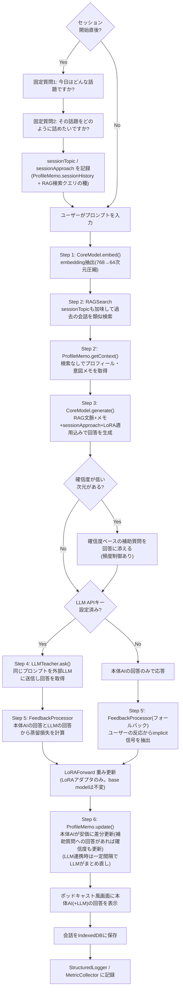

## 0. このドキュメントの位置づけ・改訂履歴

「賢い箱」は、ブラウザ内で完結する**極小の生成AI**(量子化済み・LoRA+RAG+プロフィール
メモ)を核とし、ポッドキャストアプリ風の汎用UIをまとった、会話するたびに賢くなる
アシスタントである。外部LLM(ユーザーが任意でAPIキーを設定)を「先生役」として併用でき、
その場合はユーザー・LLM・本体AI自身の三者の会話を使って本体AIを賢くしていく。

このドキュメントは6段階の改訂を経ている:

1. **初版**: Google Drive上の資料(`conversation-rag-app` フォルダ、00〜07)を統合。
   BERT+RAG+LoRAのアーキテクチャのみが決まっていて、ドメイン(何をするアプリか)は
   未決定だった。
2. **第2版**: ドメインを「パーソナル対話日記」と誤って推測し、応答を「過去エントリの
   提示・テンプレート質問・固定確認文」の3類型に限定、生成モデルを排除する設計にした。
   →ユーザーから「勝手に別のアプリになっている」と指摘され誤りと判明。
3. **第3版**: ユーザーとの対話で判明した正しいコンセプトに基づき全面改訂(生成モデル+
   LoRA+RAG、ポッドキャスト風UI、LLM任意連携による蒸留)。
4. **第4版**: 「賢くなる仕組み」の3本目の柱として、ユーザーのプロフィールや質問意図の
   傾向をAIが継続的にまとめる**プロフィール・意図メモ**を追加。RAGとは独立した軽量メモ
   として持つ設計にした(第1.5節)。
5. **第5版**: セッション開始時に固定で2問(「今日はどんな話題ですか?」「その話題を
   どのように詰めたいですか?」)を尋ねる仕組みを追加。しかしこのとき、第4版の
   「確信度が低い次元を検出して都度質問する」仕組みを**誤って完全に削除してしまった**。
6. **本版(第6版)**: ユーザーから「確信度システムを効率が悪いとは言っていない。全てを
   RAG/LoRAという重い仕組みにせず軽くする、というのが元のコンセプトであり、確信度の
   仕組みを全部外せという意味ではない」という訂正を受け、第5版での削除を撤回。
   セッション開始の固定質問(安価・即効性があり、コールドスタートに強い)と、確信度ベースの
   セッション途中の補助質問(固定質問では拾えない細かい傾向を継続的に拾える)は、
   **どちらもRAG/LoRAを介さない軽量な仕組みという共通点を持つ、互いに補完し合う2つの
   手段**として併用する(第1.6節)。

---

## 1. コンセプト

### 1.1 何を作るか
「賢い箱」は、ポッドキャストアプリのような見た目を持つ、パーソナルな会話AIウィジェット
である。ユーザーが話しかける(テキスト入力)と、ブラウザ内で完結する極小の生成AI
(「本体AI」)が自分の言葉で答える。会話を重ねるほど、本体AIは**LoRA・RAG・プロフィール
メモ**という3つの仕組みで、そのユーザーに合わせて賢くなっていく。

### 1.2 UIデザイン方針: ポッドキャスト風・汎用デザイン
見た目をポッドキャストアプリ風(カード型のエピソード表示、シンプルな再生/入力UI等)に
する理由は音声機能ではなく、**他のWebアプリにも転用できる汎用性の高いデザイン**にする
ためである。test001ハブの他アプリと同様、単一の`index.html`+αで完結するUIコンポーネント
として実装し、将来的に別アプリの「対話パーツ」として使い回せることを意図する。
音声入出力(録音・読み上げ)は現時点のスコープには含まない(将来拡張の余地として
第12節に記載)。

「ポッドキャストのエピソード」というメタファーは見た目だけでなく、第1.6節の
セッション開始の固定質問という**機能面のメタファー**としても効いている。

### 1.3 本体AIのアーキテクチャ原則(最重要)
- 本体AIは **1つの小型量子化生成モデル**(base model)を持つ。このモデルは
  「embedding抽出(RAG用)」と「文章生成(回答用)」の両方を兼ねる(BERT encoderと
  生成モデルを別々に持たない構成。「小さな小さな」重みという要望に沿う)。
- **base modelの重みは永久にfreezeし、一切更新しない。** 会話ごとの学習は、常に
  **LoRAアダプタ(数千パラメータ)のみ**に対して行う。
  - 理由(ユーザーの指摘そのもの): 極小モデルを実際の会話データでフルファイン
    チューニングすると、データ量的にもモデルが容易に破綻・崩壊し実用に耐えない。
    LoRAという小さな可逆的な変更に限定することで、システムを実用レベルに保つ。
  - 副次的な利点: LoRA重みは数KB程度なのでIndexedDBへの保存・複数ユーザー間の
    切り替えも軽量にできる。
- RAGは、本体AI自身のembeddingで過去の会話を検索し、生成時のコンテキストとして
  提供する(旧設計のRAG基盤をほぼそのまま流用できる)。

### 1.4 LLM連携: 三者会話による蒸留ループ(任意機能)
ユーザーが外部LLM(例: Claude API)のAPIキーを設定した場合、以下の三者会話ループが
追加で動く:

1. ユーザーがプロンプトを入力する
2. 本体AIが(LoRA適用込みで)自分の回答を生成する
3. 同じプロンプトを外部LLMにも送り、LLMの回答を得る
4. **ユーザーのプロンプト・LLMの回答・本体AI自身の回答**の3つを使い、損失
   (本体AIの回答をLLMの回答に近づける方向の教師あり損失。第5.5節参照)を計算する
5. その損失の勾配で、本体AIの **LoRAアダプタのみ** を1ステップ更新する(base modelは
   触らない。第1.3節の原則)

LLM APIキーが未設定の場合、本体AIは単体で回答を生成するのみで動作する(自己完結)。
この場合の学習信号は、旧設計から引き継いだimplicitフィードバック(質問への反応等)を
使う(第5.5節)。

**出口(画面表示・LLMへの送信)**:
- 本体AIの回答(および、LLM連携時はLLMの回答)をポッドキャスト風の画面に表示する
- LLM連携時は、ユーザーのプロンプト(および必要な文脈)をLLM APIへ送信する

### 1.5 プロフィール・意図メモ(3本目の柱)
「賢くなる仕組み」はLoRA(生成スタイルの重み調整)とRAG(個別の過去ターンの検索)
だけでなく、**ユーザーの人物像(好み・専門性など)と、ユーザーが繰り返し尋ねる質問の
意図・傾向**を、AIが継続的に要約・更新していく**コンパクトなメモ**を3本目の柱として
持つ。この3本目の柱自体が「全てをRAG/LoRAという重い仕組みに通さず、軽く済ませる」
というコンセプトの体現であり(第0節・付録B参照)、第1.6節の2つの質問機構(固定質問+
確信度ベースの補助質問)は、どちらもこのProfileMemoという軽量な仕組みの中の手段である。

**RAGに含めない理由**: 「このユーザーはコード例を好む」「抽象論より具体例を求める傾向が
ある」といった情報は、特定の過去ターン1件を検索して思い出す類のものではなく、どの
ターンでも常に参照すべき静的な人物像である。これをRAGの検索対象に混ぜると、(a) 検索の
たびに埋め込み類似度計算のノイズになる、(b) 同じ情報が何度も別ターンとして重複保存され
肥大化する、という無駄が生じる。ユーザーの言う通り「ラグ(RAG)よりも効率的」に、
常に一定サイズの固定コンテキストとして直接注入する方が理にかなっている。

**メモの中身(例)**:
```json
{
  "profile": {
    "notes": ["技術的な話題を好む", "簡潔な説明を好み、長い前置きを嫌う", "..."],
    "confidence": { "formality": 0.8, "depth": 0.4, "exampleUsage": 0.6, "codeInclusion": 0.3 }
  },
  "questionIntentPatterns": [
    "デバッグ・具体的なコード修正についての質問が多い",
    "抽象的な概念より実例を伴う説明を求める傾向"
  ],
  "sessionHistory": [
    { "topic": "転職の相談", "approach": "選択肢を整理したい", "date": "2026-09-18" }
  ],
  "lastUpdated": "2026-09-19T10:00:00Z",
  "lastLlmConsolidation": "2026-09-19T09:00:00Z | null"
}
```

**更新の仕組み**(第1.6節の2つの質問機構を含む):
- セッション開始時の固定質問(第1.6節a)への回答は`sessionHistory`に直接記録される
  (最も強く・最も安価な情報源。コールドスタートに強い)
- セッション途中、確信度が低い次元があれば補助質問(第1.6節b)を発火し、回答は
  `profile.confidence`の該当次元を更新する(固定質問だけでは拾えない細かい傾向を
  継続的に拾う)
- 加えて、毎ターン、本体AI(CoreModel)自身が安価に「今回のやり取りでメモに追記・修正
  すべき点があるか」を短く生成し、`profile.notes`/`questionIntentPatterns`へ差分反映する
- LLM連携時は、一定ターン数ごと(`profile.config.json`の`llmConsolidationIntervalTurns`。
  既定20ターン)に、外部LLMを使ってメモ全体を整理・圧縮する「まとめ直し」を行う

### 1.6 質問機構: 固定質問(a) + 確信度ベースの補助質問(b)、併用
第5版で(a)のみに一本化してしまったが、第6版で(b)を復活させ、**2つの軽量な質問機構を
併用する**設計に戻した。両者は役割が異なり、互いに代替できない:

**(a) セッション開始時の固定質問**(第5版で追加、効率的な入り口)
各セッション(ポッドキャストの「エピソード」に相当)の冒頭で、AIは固定の2問を尋ねる:
1. 「今日はどんな話題ですか?」 → `sessionTopic`として記録。RAGSearchの検索クエリの種、
   ProfileMemoの`sessionHistory`への記録に使う
2. 「その話題をどのように詰めたいですか?」 → `sessionApproach`として記録。このセッション
   中のCoreModel.generate()のスタイルに直接反映

質問文言はテンプレート固定(`profile.config.json`)。**強み**: 安価・即座・会話1回目
(履歴ゼロ)でも同じ強さの手がかりが得られる(コールドスタートに強い)。**弱み**: 毎回
同じ2問なので、固定質問がカバーしない細かい次元(フォーマル度、コード例の要否等)は
拾えない。

**(b) 確信度ベースの補助質問**(第4版で導入、第5版で誤って削除、第6版で復活)
`ProfileMemo.profile.confidence`の各次元(`profile.config.json`の`trackedDimensions`:
formality, depth, exampleUsage, codeInclusion)のうち、閾値
(`confidenceThresholdForClarifyingQuestion`)未満のものがあれば、それを埋めるための
短い確認質問を本体AIの回答に添える。**強み**: セッションをまたいで継続的に、固定質問
だけでは拾えない粒度の情報を安く集められる。**弱み**: 確信度が閾値を超えるまで複数
ターンかかるため即効性は無く、会話1回目にはまだ発火しない(だからこそ(a)と併用する
意味がある)。頻度は`profile.config.json`の`maxClarifyingQuestionsPerSession`で制御する。

**両者の関係**: (a)は「毎セッション必ず聞く、粗いが即効性のある2問」、(b)は
「必要な時だけ聞く、細かいが収束に時間がかかる補助質問」。どちらもRAG(検索)や
LoRA(重み学習)という重い仕組みを介さない、ProfileMemo内の軽量なテキストベースの
仕組みである点は共通する。

---

## 2. システムアーキテクチャ

### 2.1 全体構成
```
CoreModel (量子化された小型生成モデル。embedding抽出+文章生成を兼ねる。base weightsはfreeze)
  + LoRA (数千パラメータのアダプタのみを学習対象とする)
  + RAG (CoreModelのembeddingで過去の会話を検索、64次元に圧縮)
  + ProfileMemo (ユーザー像・質問意図傾向の軽量な要約メモ。固定質問+確信度ベース補助質問の
    2機構を持つ。検索なしで常時コンテキストに注入)
  + LLMTeacher (任意。外部LLM APIを呼び、蒸留の教師信号 & メモのまとめ直しを提供)
```

### 2.2 ターン処理フロー



### 2.3 モジュールと責務(一覧)

| モジュール | 責務 | 入力 | 出力 | 目標コスト |
|---|---|---|---|---|
| CoreModel | embedding抽出 **と** 文章生成の両方(base weightsはfreeze) | text, ragContext, profileContext | embedding(64d), 生成テキスト | 生成 <1500ms(端末依存) |
| RAGSearch | 類似会話検索 | embedding | 類似ターン一覧, confidence | <20ms |
| ProfileMemo | ユーザー像・質問意図傾向の要約メモの保持・差分更新、セッション開始の固定質問+確信度ベース補助質問の管理 | turnData, sessionTopic/Approach, (任意)LLM | プロフィール文脈, 補助質問候補 | 差分更新 <50ms |
| IndexedDBManager | 会話・LoRA重み・LLM設定・ProfileMemoの永続化 | turnData | — | — |
| LLMTeacher | 任意。外部LLM APIの呼び出し(蒸留・メモのまとめ直し) | prompt, apiConfig | LLMの回答text | ネットワーク依存 |
| LoRAForward | CoreModelのquery/value等へのLoRA順伝播 | hiddenState + LoRA重み | 適応後の生成 | <1ms/層 |
| FeedbackProcessor | 蒸留損失(LLM連携時) / engagement信号(単体時)の算出 | own answer, llm answer?, user反応 | 学習ラベル・損失 | <50ms |
| TurnController | 全体オーケストレーション(セッション開始の固定質問を含む) | userPrompt | 本体AI回答(+LLM回答) | 合計端末依存 |
| StructuredLogger | 構造化ログ記録 | turn/event data | ログ永続化(json/csv) | — |
| MetricCollector | メトリクス集計・目標値との比較 | ログ | 集計結果・アラート | — |
| ABTestRunner | バリアント割当・効果測定 | userId | variant, 記録 | — |

---

## 3. リポジトリ内フォルダ構成

```
docs/apps/smart-box/
├── DESIGN.md
├── README.md
├── package.json
├── .gitignore
├── configs/
│   ├── system.config.json
│   ├── rag.config.json
│   ├── profile.config.json    ← 固定質問テンプレート + 確信度ベース補助質問の閾値・頻度
│   ├── llm.config.json        ← 外部LLM連携設定(APIキーはconfigに書かず、UIから
│   │                              入力しIndexedDB/localStorageにのみ保存する)
│   └── lora.config.json
├── src/
│   ├── modules/
│   │   ├── core-model/CoreModel.js
│   │   ├── rag-search/RAGSearch.js, IndexedDBManager.js
│   │   ├── profile-memo/ProfileMemo.js
│   │   ├── llm-teacher/LLMTeacher.js
│   │   ├── lora-training/LoRAForward.js, FeedbackProcessor.js
│   │   ├── turn-controller/TurnController.js
│   │   ├── logging/StructuredLogger.js, MetricCollector.js
│   │   └── experiments/ABTestRunner.js
│   └── ui/index.html, app.js, styles.css   ← ポッドキャスト風デザイン。Phase 1で実装
├── models/README.md
└── tests/unit/, tests/integration/
```

---

## 4. Config仕様

### 4.1 configs/system.config.json
- モデル: CoreModelの量子化生成モデルへのURL(第8.1節、モデル候補は未確定)
- 実行環境: WebGPU優先、非対応時はwasm CPUにフォールバック
- ストレージ・ロギング・実験設定は旧版を維持

### 4.2 configs/rag.config.json
CoreModelのembeddingを使う(PCA圧縮・topK・閾値等は維持)。ProfileMemoの情報は
含めない(第1.5節の理由により意図的に分離)。

### 4.3 configs/profile.config.json(改訂: (a)(b)両方の設定を持つ)
```json
{
  "sessionOpeningQuestions": {
    "topic": "今日はどんな話題ですか?",
    "approach": "その話題をどのように詰めたいですか?"
  },
  "updateEveryTurn": true,
  "llmConsolidationIntervalTurns": 20,
  "trackedDimensions": ["formality", "depth", "exampleUsage", "codeInclusion"],
  "confidenceThresholdForClarifyingQuestion": 0.4,
  "maxClarifyingQuestionsPerSession": 3,
  "note": "DESIGN.md 1.6節: (a)セッション開始の固定質問と(b)確信度ベースの補助質問は併用する。どちらもRAG/LoRAを介さない軽量な仕組み。第5版で(b)を誤って削除したが第6版で復活させた。"
}
```

### 4.4 configs/llm.config.json
```json
{
  "enabled": false,
  "provider": "anthropic",
  "apiKeyStorage": "indexeddb-local-only",
  "model": "claude-...",
  "note": "APIキーはユーザーがUIから入力し、ブラウザのIndexedDB/localStorageにのみ保存する。configファイル自体にキーを書かない。サーバーには一切送信しない。蒸留(第1.4節)とProfileMemoのまとめ直し(第1.5節)の両方でLLMを使う。"
}
```

### 4.5 configs/lora.config.json
- 3階層(global/topic/style)のLoRA構成を維持
- 適用対象は「CoreModelの生成時のquery/value射影」(本来のLoRAの使い方)
- 学習方式: 第1.4節の蒸留損失、またはengagementベースのimplicit信号。どちらも
  **LoRA行列のみ**を対象に更新する(base modelは不変)
- ProfileMemoの更新はLoRAの学習対象ではない(重みではなくテキスト/構造化データの
  差分更新であり、別の軽量な仕組み。第5.3節参照)

---

## 5. モジュール設計詳細

### 5.1 CoreModel (`src/modules/core-model/CoreModel.js`)
- **責務**: 量子化された小型生成モデルをロードし、(a) embedding抽出、(b) LoRA適用込みの
  文章生成、の両方を行う。base weightsは常にfreeze。
- **主要API**:
  - `async initialize()`
  - `async embed(text): Promise<{embedding: Float32Array(64), rawEmbedding, latencyMs}>`
  - `async generate(prompt, ragContext, profileContext, loraForward): Promise<{text: string, latencyMs}>`
    — RAG文脈とProfileMemoの文脈の両方を入力し、LoRAForwardを注入して生成の各層で
    LoRA補正を適用する
  - `async summarizeForProfile(turnData): Promise<{ profileDelta: object }>` —
    毎ターンの安価な差分更新用に、CoreModel自身で短い要約を生成する(ProfileMemoから
    呼ばれる)
- **モデル候補(未確定・Phase 0で検証要)**: Qwen2.5-0.5B-Instruct級の小型多言語モデルを
  int4量子化し、`transformers.js`(WebGPU対応)または`onnxruntime-web`で実行する案を
  第一候補とする。実機でのロード時間・推論速度・メモリ使用量の検証がPhase 0のタスク。

### 5.2 RAGSearch / IndexedDBManager
- RAGSearchはembedding類似検索(旧版と同じ)。sessionTopicをクエリの種として使える
- IndexedDBManagerは会話・LoRA重み・LLM設定に加え、`metadata`ストアに
  ProfileMemoのドキュメント(第1.5節のJSON)も保持する

### 5.3 ProfileMemo (`src/modules/profile-memo/ProfileMemo.js`)
- **責務**: ユーザーの人物像と質問意図の傾向を要約したメモ(第1.5節)を保持・更新する。
  RAGとは独立した、検索を伴わない常時参照コンテキスト。第1.6節の(a)(b)両方の質問機構の
  結果もここに記録する。
- **主要API**:
  - `async getContext(): Promise<string>` — CoreModel.generate()に渡す、現在のメモの
    テキスト表現を返す(固定サイズに収まるよう要約済みであること)
  - `async recordSessionOpening(sessionTopic, sessionApproach): Promise<void>` —
    (a)固定質問2問への回答を`sessionHistory`に記録する
  - `getLowConfidenceDimensions(): string[]` — (b)確信度が
    `confidenceThresholdForClarifyingQuestion`未満の次元を返す。TurnController側で
    補助質問を発火するかどうかの判定に使う(第4版で導入、第5版で誤って削除、第6版で復活)
  - `async recordConfidenceAnswer(dimension, answer): Promise<void>` — (b)補助質問への
    回答を`profile.confidence`の該当次元に反映する
  - `async update(turnData, coreModel): Promise<void>` — 毎ターン、CoreModelの軽量な
    要約(`CoreModel.summarizeForProfile()`)を使ってメモに差分反映する
  - `async consolidateWithLLM(llmTeacher): Promise<void>` —
    `profile.config.json`の`llmConsolidationIntervalTurns`ごとに呼ばれ、外部LLMで
    メモ全体を整理・圧縮する(LLM連携時のみ)
- **永続化**: IndexedDBManagerの`metadata`ストアに1ドキュメントとして保存。

### 5.4 LLMTeacher (`src/modules/llm-teacher/LLMTeacher.js`)
- **責務**: `llm.config.json`が`enabled: true`の場合のみ、(a) ユーザーのプロンプトを
  外部LLM APIに送信し回答を取得する(蒸留用)、(b) ProfileMemoのまとめ直しを依頼する、
  の2つの役割を持つ。
- **主要API**:
  - `async ask(prompt, ragContext): Promise<{text: string, latencyMs}>`
  - `async consolidateProfile(currentMemo, recentTurns): Promise<{ consolidatedMemo: object }>`
- **セキュリティ**: APIキーはブラウザのIndexedDB/localStorageにのみ保存し、サーバー
  (存在しない)や第三者には一切送信しない。

### 5.5 LoRAForward / FeedbackProcessor
(変更なし。CoreModelのquery/value射影へのLoRA適用、蒸留損失/implicit損失の算出。
ProfileMemoの更新とは独立した仕組みである点に注意)

### 5.6 TurnController
- セッションの最初のユーザー操作時、(a)固定質問2問を発火し、回答を
  `ProfileMemo.recordSessionOpening()`に渡す
- 通常ターンの生成後、`ProfileMemo.getLowConfidenceDimensions()`を確認し、対象があれば
  (b)確信度ベースの補助質問を回答に添える(頻度制御あり)
- 以降は第2.2節の通常フロー(RAG検索とProfileMemo取得を両方行い、生成後にLoRA更新と
  ProfileMemo更新を両方行う)をオーケストレーションする

### 5.7〜5.9 StructuredLogger / MetricCollector / ABTestRunner
(変更なし。(a)(b)双方の質問の発火率・回答率もログ対象に加える)

---

## 6. データフロー: ターンごとの保存形式

```json
{
  "turn_id": "turn_<timestamp>_<random>",
  "session_id": "session_<timestamp>",
  "is_session_opening": false,
  "timestamp": "2026-09-19T10:30:00Z",
  "input": {
    "user_prompt": "...",
    "embedding": "[64-dim float32]"
  },
  "rag": {
    "retrieved_turns": 3,
    "top_similarities": [0.92, 0.85, 0.78]
  },
  "profile_memo": {
    "context_used": "...(getContext()のスナップショット)",
    "updated_this_turn": true,
    "llm_consolidated_this_turn": false,
    "clarifying_question": { "dimension": "codeInclusion", "text": "..." } 
  },
  "response": {
    "own_answer": "...",
    "llm_answer": "... | null",
    "llm_used": true
  },
  "learning": {
    "mode": "distillation | implicit",
    "loss_before": 0.45,
    "loss_after": 0.38
  }
}
```

セッション開始時の固定質問2問は、`is_session_opening: true`の専用ターンとして記録し、
その回答(`sessionTopic`/`sessionApproach`)は`profile_memo`セクションではなく
`ProfileMemo.sessionHistory`(第1.5節)に直接記録する。

---

## 7. IndexedDBスキーマ
`turns`/`metadata`/`logs`の3ストア構成。`metadata`ストアに以下を保持する:
- LoRA重み(A/B行列、3階層分)
- LLM APIキー・設定
- ProfileMemoドキュメント(第1.5節のJSON。`sessionHistory`と`profile.confidence`を含む。
  1ユーザー1件)

---

## 8. 技術的リスクと対応方針

### 8.1 ブラウザ内生成モデル + LoRA学習の実現可能性(最重要・未検証)
base modelは常にfreezeし、勾配計算・更新対象は**LoRAのA/B行列のみ**に限定する
(第1.3節)。実装には生成モデルのforwardを自動微分できるランタイムが必要で、
**この技術検証はPhase 0で最優先に行うべき未解決事項**である。

### 8.2 モデル選定
Qwen2.5-0.5B-Instruct級モデルのブラウザ内(WebGPU/wasm)実行速度・メモリ・ロード時間の
実機検証がPhase 0のタスク。

### 8.3 LLM APIキーの扱い
ブラウザのIndexedDB/localStorageにのみ保存し、サーバー(存在しない)には送信しない。

### 8.4 蒸留損失の設計
LLMの回答文をteacher-forcingのターゲットにする方式は実装可能だが、学習の安定性は
Phase 1.5で実ログを見ながら調整する。

### 8.5 ProfileMemoの肥大化・陳腐化リスク
毎ターンの差分更新だけを続けると、メモが冗長化・矛盾を含むようになるおそれがある。
LLM連携時の定期的な「まとめ直し」(第1.5節)はこれを防ぐ主な対策。セッション開始の
固定質問による`sessionHistory`、確信度ベース補助質問による`profile.confidence`は
どちらも構造化されているため、この肥大化リスクの影響を受けにくい。

---

## 9〜11節
テスト戦略・開発原則・フェーズロードマップの大枠は第3版を踏襲する。Phase 1のスコープに
(a)固定質問2問と(b)確信度ベース補助質問の両方を含める(第6版で両方採用したため)。

## 12. 次にやること(直近アクション)

1. **(最優先)** 生成モデル候補(第5.1節)の実機検証
2. **(最優先)** LoRA部分のみを対象にした逆伝播が技術的に実現できるかの検証(第8.1節)
3. `CoreModel.js` の実装(embed + generate + summarizeForProfile)
4. `ProfileMemo.js` の実装((a)固定質問の記録 + (b)確信度ベース補助質問 + 毎ターンの
   差分更新。LLMまとめ直しはPhase 2)
5. `LLMTeacher.js` の実装(蒸留・ProfileMemoまとめ直し・APIキーのローカル保存UI)
6. `LoRAForward.js` / `FeedbackProcessor.js` の実装(蒸留損失・LoRA更新)
7. ポッドキャスト風UI(`src/ui/`)の実装(固定質問2問の画面・補助質問の表示を含む)
8. `TurnController` で結線し、Core loopを動かす
9. `docs/apps.json` への登録

(将来拡張として、音声入出力の追加も検討余地として残す。現時点のスコープ外)

---

## 付録B: 第5版での削除とその撤回(2026-09-19)

第5版で「セッション開始の固定質問2問」を導入した際、第4版の確信度ベースの補助質問を
「複雑で非効率」と判断して完全に削除してしまった。しかしユーザーからの訂正:「確信度の
システムは効率が悪いのか?別の良さがある。全てをRAGとLoRAにせず軽くすると言うコンセプト
だった。全てを外せとは言っていない」を受け、これは誤りだったと判明した。

正しい理解: ProfileMemoという3本目の柱そのものが「RAG(検索)やLoRA(重み学習)という
重い仕組みに全てを頼らず、軽量な手段も併用する」というコンセプトの実装であり、固定質問と
確信度ベース補助質問は、その軽量な手段の中の2つの具体的な手法として共存すべきものだった。
第6版でこれを訂正し、両方を採用する設計に戻した(第1.6節)。
