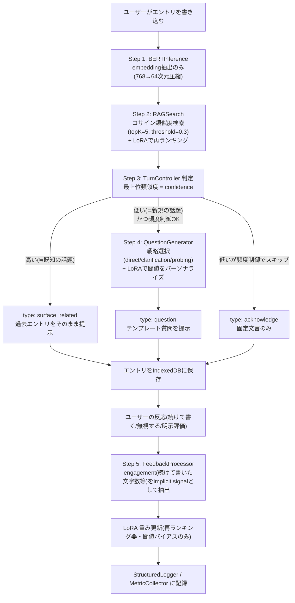

## 0. このドキュメントの位置づけ

「賢い箱」は、ユーザー自身の日々の記録(思ったこと・出来事・判断)を書き溜めていくと、
過去の関連する記録を思い出させてくれたり、深掘りする質問を投げかけてくれたりする、
**パーソナル対話日記アシスタント**である。ブラウザ完結・サーバー不要・API課金なしで動く。

設計資料はGoogle Drive上に `conversation-rag-app` フォルダとして8本(`00_README.md` 〜
`07_COWORK_SESSION_HANDOFF.md`)保存されている。本ドキュメントはそれらを土台にしつつ、
**2026-09-19の設計レビューで見つかった構造的な欠落(応答生成方式が未定義、LoRAの適用対象が
生成モデル不在と矛盾)を解消し、具体的な製品として再設計したもの**である。

**重要な経緯**: 当初のGoogle Drive資料は、アーキテクチャ(BERT+RAG+LoRA)だけが先に
決まっていて、「このアシスタントが実際に何をするものか(ドメイン)」が一度も決まっていな
かった。ユーザーとのレビューで「パーソナルメモ/対話日記」に決定した(付録B参照)。この
決定により、以下が同時に解決した:

1. **応答生成方式**: BERT-base-japaneseは生成モデルではなく分類・embedding専用のため、
   自由文を生成する設計は成立しない。日記ドメインでは「過去の関連エントリをそのまま提示する」
   「テンプレート質問を投げる」の2つだけで用が足りるため、生成モデルが不要になった。
2. **LoRAの適用対象**: 「応答のトーンを変える」という生成前提の役割をやめ、「RAG検索結果の
   再ランキング」「質問を出す閾値のパーソナライズ」という、エンコーダ+小さなアダプタで
   現実的に実現できる役割に絞った。
3. **意図分類ヘッドが不要に**: confidenceの定義をBERTのsoftmax確信度(較正が悪く不適切と
   判明)からRAG類似度ベースに変更したことで、教師データが必要な意図分類ヘッドの学習が
   不要になり、MVPスコープが大きく縮小した。

**Config正本の優先順位**: `04_CONFIG_TEMPLATES.md`(9/18ドラフト)と
`07_COWORK_SESSION_HANDOFF.md`(9/19確定)の数値は07を正とする(付録A参照)。ただし
本ドキュメントの2026-09-19レビューによる変更(本節・第1〜2節・第5節・第8節)は07より
さらに新しく、07の一部記述(意図分類前提の設計)を上書きする。

---

## 1. コンセプト: パーソナル対話日記

### 1.1 何をするアプリか
ユーザーが「今日あったこと」「考えていること」「迷っている決断」などを自由に書き込む。
書き込むたびに賢い箱は:

- 過去に書いた似た内容のエントリがあれば、それをそのまま(要約や解釈を加えず)提示する
  例:「9/3にも同じことで悩んでいましたね:『(その時の本文)』」
- 過去に似た内容がなければ(=初めて出てきた話題)、深掘りする質問を投げて記録を厚くする
  例:「それについて、今どう感じていますか?」
- どちらでもなければ、記録したことだけを軽く確認する
  例:「記録しました。」

**やらないこと(意図的な制約)**: 日記の内容を要約したり、解釈したり、アドバイスしたり、
新しい文章を生成したりは一切しない。理由は2つ: (1) BERT-base-japaneseは生成モデルでは
なく技術的に不可能、(2) 個人の日記に対して自由生成すると内容を捏造・誤解釈するリスクが
あり、日記アプリとしては実害が大きい。「何も足さない・何も引かない」を設計原則とする。

### 1.2 特徴
| 特徴 | 内容 |
|---|---|
| 軽量BERT | `bert-base-japanese` をONNX化(約30MB)、embedding抽出専用(分類ヘッド不要) |
| 連想検索(RAG) | 768→64次元embeddingで過去エントリを類似検索し、関連記録を思い出させる |
| 質問駆動 | 類似エントリが無い(=confidence低)時だけ、深掘り質問で記録を促す |
| パーソナライズ(LoRA) | 「どの過去エントリを重視するか」「質問される頻度の好み」をユーザーごとに学習 |
| 完全無料・非改変 | サーバー不要。日記の中身を要約・生成・改変しない(付録B参照) |

### 1.3 応答の3類型(旧設計の「generateResponse」プレースホルダーを置き換える)

| type | いつ使うか | 中身 |
|---|---|---|
| `surface_related` | RAG類似度が高い(過去と強く関連) | 該当する過去エントリを日付つきでそのまま提示。文章は一切生成しない |
| `question` | RAG類似度が低い(初めての話題) | question.config.jsonのテンプレートを埋めた質問文(第5.4節) |
| `acknowledge` | 上記どちらにも該当しない/頻度制御でスキップ | 固定文言(例:「記録しました。」)のみ。生成なし |

### 1.4 confidenceの再定義(旧設計からの変更点)
旧設計はBERTのintent分類softmax値をconfidenceとして使う想定だったが、(a) 量子化された
小型モデルのsoftmaxは較正が悪く「理解度」の代理指標として不適切、(b) 意図分類には教師
データが必要でMVPの前提が崩れる、という2つの問題があった。

**新定義**: confidence = RAGSearchで得られる**最上位類似度スコアそのもの**
(`rag.config.json` の `minSimilarityThreshold` 前後を境に判定)。

- 類似度が高い(強く関連する過去エントリがある) → 「今日の内容は文脈的に理解できている」
  とみなし `surface_related` を返す
- 類似度が低い(初めての話題、または日記を書き始めたばかりで履歴が少ない) →
  「深掘りする価値がある新規性の高い話題」とみなし `question` を返す

この定義変更により、**BERTの分類ヘッド(教師データが必要)が不要になった**。BERTInference
は「embedding抽出専用」に簡素化される(第5.1節)。

---

## 2. システムアーキテクチャ

### 2.1 全体構成
```
BERT-base-japanese (凍結・embedding抽出専用。分類ヘッドは持たない)
  + RAG (64-dim embedding, ローカルインデックス、confidenceの算出も兼ねる)
  + LoRA (2つの役割に限定: 検索結果の再ランキング / 質問閾値のパーソナライズ)
  + User Model (質問への反応履歴)
```

### 2.2 ターン処理フロー(改訂版)



### 2.3 モジュールと責務(一覧、改訂)

| モジュール | 責務 | 入力 | 出力 | 目標コスト |
|---|---|---|---|---|
| BERTInference | embedding抽出のみ(分類ヘッド無し) | text | embedding(64d) | 推論 <500ms |
| RAGSearch | 類似ターン検索+confidence算出+LoRA再ランキング | embedding | 類似ターン一覧, confidence | <20ms |
| IndexedDBManager | エントリ永続化・CRUD | entryData | — | — |
| QuestionGenerator + strategies | 質問生成(confidence低の時のみ) | ragContext | question text or null | <5ms |
| LoRAForward | 検索再ランキング / 質問閾値バイアスの順伝播 | embedding + LoRA重み | 再ランキングスコア, 閾値バイアス | <1ms |
| FeedbackProcessor | engagement信号(続けて書いた量等)の抽出 | 次エントリとの時間差・文字数 | preference delta | <5ms |
| TurnController | 全体オーケストレーション、3類型のうちどれを返すか決定 | user_entry | response(3類型のいずれか) | 合計 <1000ms |
| StructuredLogger | 構造化ログ記録 | turn/event data | ログ永続化(json/csv) | — |
| MetricCollector | メトリクス集計・目標値との比較 | ログ | 集計結果・アラート | — |
| ABTestRunner | バリアント割当・効果測定(質問閾値等) | userId | variant, 記録 | — |

---

## 3. リポジトリ内フォルダ構成

test001は「アプリハブ」(`docs/apps/<id>/` にミニアプリを追加していく構成)のため、
「賢い箱」は `docs/apps/smart-box/` 以下に、独立プロジェクトとして完結する形で配置する。

```
docs/apps/smart-box/
├── DESIGN.md                 ← 本ファイル(詳細設計書)
├── README.md                 ← クイックスタート・進め方
├── package.json              ← 開発時のみ使用(テストランナー等。本番は無ビルド)
├── .gitignore
├── configs/
│   ├── system.config.json
│   ├── rag.config.json
│   ├── question.config.json
│   └── lora.config.json
├── src/
│   ├── modules/
│   │   ├── bert-inference/BERTInference.js
│   │   ├── rag-search/RAGSearch.js, IndexedDBManager.js
│   │   ├── question-generator/QuestionGenerator.js
│   │   │   └── strategies/Strategy.js, direct.js, contrastive.js,
│   │   │                  clarification.js, probing.js
│   │   ├── lora-training/LoRAForward.js, FeedbackProcessor.js
│   │   ├── turn-controller/TurnController.js
│   │   ├── logging/StructuredLogger.js, MetricCollector.js
│   │   └── experiments/ABTestRunner.js
│   └── ui/index.html, app.js, styles.css   ← Phase 1で実装(現時点では未作成)
├── models/README.md          ← ONNXモデルの配置方法(CDN配信、リポジトリに同梱しない)
└── tests/unit/, tests/integration/
```

**test001の他アプリとの違い**: `hello` や `url-viewer` は単一HTMLで完結する軽量アプリだが、
「賢い箱」は本格的なモジュール構成を持つため、`avatar`アプリ(lib/・animations/・models/を
持つ)と同様に、フォルダ構成を持つ「重い」ミニアプリとして扱う。

**モジュール形式**: 全モジュールをネイティブESM(`export class` / `export default`)で実装
する。`onnxruntime-web` 等の外部依存は `index.html` 内の import map でjsDelivrから読み込む
(`avatar`アプリの three.js と同じ方式)。

**ハブへの登録タイミング**: 現時点ではモジュールは全てJSDocインターフェースのみのスタブで
あり、動作するUIが無い。`docs/apps.json` への登録(ハブ一覧への表示)は、Phase 1 MVP
(日記を書く→関連エントリ提示 or 質問、のCore loopが動作する状態)が完成してから行う。

---

## 4. Config仕様(正本)

以下は `07_COWORK_SESSION_HANDOFF.md` の確定値をベースに、第1〜2節の改訂(confidence再定義・
応答3類型・LoRA役割限定)を反映したもの。

### 4.1 configs/system.config.json
- モデル: `bert-base-ja-int8.onnx`(int8量子化、期待サイズ30MB)、`maxSequenceLength: 128`
  **分類ヘッドは使わない(embedding抽出のみ)**
- 実行環境: wasmバックエンド、4スレッド、ロード時ウォームアップあり
- ストレージ: IndexedDB `conversation-rag-db`、最大1000エントリ保存、100件ごとに圧縮、
  容量警告40MB/上限80MB
- ロギング: 有効、`info`レベル、IndexedDBへも永続化、json/csvエクスポート対応
- 実験: A/Bテスト有効、sticky assignment(同一ユーザーは常に同じバリアント)
- 目標値: 推論 <500ms、ターン合計 <1000ms
  (※旧目標値の意図分類精度0.85・entity F1 0.70・文脈理解0.70は、意図分類ヘッドを廃止した
  ため削除。代わりの品質指標は第8.5節「新しい評価指標」を参照)

### 4.2 configs/rag.config.json
- embedding: 768→64次元にPCA固定射影で圧縮(第8.3節、未生成)
- 検索: topK=5、コサイン類似度、最小類似度閾値0.3、検索レイテンシ目標20ms
- **`minSimilarityThreshold` がそのままconfidenceの判定境界を兼ねる(第1.4節)**
- コンテキスト窓: 直近3エントリは常に含める、検索結果は最大5件まで追加
- ストレージ: ユーザーあたり最大1000エントリ、100件で要約トリガー、1件あたり推定10KB

### 4.3 configs/question.config.json (日記ドメイン向けにテンプレート改訂)
- 戦略: direct / contrastive / clarification / probing の4種
- 選択ロジック: **confidence(=RAG類似度)が低いほど深掘り系(probing)を選ぶ**
  (旧: confidenceベースの閾値ロジック自体は維持、意味だけ意図分類→RAG類似度に変更)
- テンプレート例(日記向けに変更。旧: 技術説明ドメインの汎用文言):
  - direct: 「それについて、もう少し聞かせてください」
  - contrastive: 「{date}にも近いことを書いていましたが、今回は前と同じ感じですか、
    それとも変わりましたか?」
  - clarification: 「これは{optionA}についてですか、それとも{optionB}についてですか?」
  - probing: 「これは今後どうしていきたいと思っていますか?」
- 頻度制御: 1日あたり最大5問、質問間は最低2エントリ空ける、confidence高い時はスキップ
- 効果測定: 質問への反応(続けて書いた文字数・時間)をprediction-gap的な指標として使う

### 4.4 configs/lora.config.json (役割限定に伴い改訂)
- 3階層LoRA(global/topic/style)は維持するが、**適用対象を「RAG再ランキング用embedding」
  「質問閾値バイアス」に限定**(旧: 「応答生成」という未定義の対象を修正)
- global(rank=4) — 「質問される頻度への耐性」等ユーザー全体の傾向、ゆっくり更新
- topic(rank=2) — 話題ジャンルごとの検索重視度、中速更新
- style(rank=1) — 質問戦略(direct/contrastive/clarification/probing)の好み、最速更新
- 学習: proximal正則化(λ=0.01)、batchSize=1、ターンごとに更新、experience replay 50件
- **未確定事項**: 学習率・proximalLambdaは仮値。Phase 1.5のA/Bテストで実測調整する方針は
  変更なし
- フィードバック信号(改訂): 明示的な訂正/評価が無い日記アプリの特性上、**implicitのみを
  主とする**。「質問後、一定時間内に文字数の多い追記があった」→ポジティブ、「質問を無視して
  次のエントリに移った」→ネガティブ、という2値信号を基本とする

実際のJSONファイル全文は `configs/*.json` を参照。

---

## 5. モジュール設計詳細

### 5.1 BERTInference (`src/modules/bert-inference/BERTInference.js`) — 改訂
- **責務**: ONNX Runtime Web(wasmバックエンド)でBERTモデルをロードし、テキストから
  **圧縮embedding(64次元)のみ**を得る。**分類ヘッドは持たない**(第1.4節の理由により
  不要になった)。
- **主要API**:
  - `async initialize()` — モデル・トークナイザのロード、ウォームアップ実行
  - `async embed(text: string): Promise<{embedding: Float32Array(64), rawEmbedding: Float32Array(768), latencyMs}>`
    (旧 `classify()` から intent/confidence を除いたもの。関数名も実態に合わせ変更)
  - `compress(embedding768: Float32Array): Float32Array` — PCA固定射影(行列積で実装)
- **エラー処理**: モデルロード失敗時は例外を投げ、TurnController側で `acknowledge` 型の
  固定応答(「現在AI機能が利用できません。記録のみ行いました。」)にフォールバックする。

### 5.2 IndexedDBManager (`src/modules/rag-search/IndexedDBManager.js`)
(変更なし。DESIGN.md旧版の内容を維持)

### 5.3 RAGSearch (`src/modules/rag-search/RAGSearch.js`) — 改訂
- **責務**: クエリembeddingと全エントリのコサイン類似度を計算し、topK件を返す。
  **さらに、最上位類似度をconfidenceとしてTurnControllerに渡す**(第1.4節)。
- **主要API**: `async search(queryEmbedding, topK=5, minSimilarity=0.3): Promise<{retrievedEntries, similarities, confidence: number, latencyMs}>`
  (`confidence` は `similarities[0]`、0件時は0)
- LoRAForwardが提供する再ランキングスコアで `retrievedEntries` の順序を調整するオプションを
  持つ(`rerank(candidates, loraForward)`)。

### 5.4 QuestionGenerator + strategies (`src/modules/question-generator/`)
- 変更点: `confidence` の意味がBERT分類確信度からRAG類似度に変わった点を除き、戦略選択の
  仕組み自体は維持(第4.3節のテンプレート改訂を反映)。

### 5.5 LoRAForward (`src/modules/lora-training/LoRAForward.js`) — 大幅改訂
- **旧責務(誤り)**: 「応答のトーンを変える順伝播」— 生成モデルが無いため成立しなかった。
- **新責務**:
  1. `rerankScore(queryEmbedding, candidateEmbedding, layerName): number` —
     RAGSearchの検索結果を並べ替えるためのユーザー適応スコアを返す
  2. `thresholdBias(layerName): number` — `rag.config.json` の `minSimilarityThreshold`
     に対するユーザーごとの補正値を返す(質問されるのを好む/好まないユーザー差を吸収)
- 3階層(global/topic/style)の意味は第4.4節の通り再定義。

### 5.6 FeedbackProcessor (`src/modules/lora-training/FeedbackProcessor.js`) — 改訂
- **責務**: 明示的評価に頼らず、**engagement(質問後に続けて書いた文字数・経過時間)**を
  implicit信号として抽出する。
- **主要API**: `process(nextEntryTimingAndLength, turnData): {engagementScore, trainingLabel}`
- 技術的な実装方針(第8.1節)は変更なし: LoRAのA/B行列のみ手動勾配で更新、BERT本体はfreeze。

### 5.7 TurnController (`src/modules/turn-controller/TurnController.js`) — 改訂
- **責務**: 第2.2節の改訂シーケンス(surface_related / question / acknowledge の3分岐)を
  オーケストレーションする。
- **主要API**: `async processTurn(userEntry): {responseType: 'surface_related'|'question'|'acknowledge', payload, turnData}`

### 5.8〜5.10 StructuredLogger / MetricCollector / ABTestRunner
(責務は変更なし。ログ対象・メトリクス定義が第4.1節の目標値変更に伴い一部変わる。第8.5節参照)

---

## 6. データフロー: エントリごとの保存形式(改訂)

```json
{
  "turn_id": "turn_<timestamp>_<random>",
  "timestamp": "2026-09-19T10:30:00Z",
  "input": {
    "user_text": "...",
    "embedding": "[64-dim float32]"
  },
  "rag": {
    "retrieved_entries": 3,
    "top_similarities": [0.92, 0.85, 0.78],
    "confidence": 0.92
  },
  "response": {
    "type": "surface_related | question | acknowledge",
    "text": "...",
    "strategy": "direct | clarification | probing | contrastive | null"
  },
  "engagement": {
    "nextEntryDelaySec": 45,
    "nextEntryLength": 320,
    "engagementScore": 0.8
  },
  "learning": {
    "lora_loss_before": 0.45,
    "lora_loss_after": 0.38
  }
}
```

---

## 7. IndexedDBスキーマ

(変更なし。DESIGN.md旧版の内容を維持。`turns` object storeの意味は「会話ターン」から
「日記エントリ」に読み替える)

---

## 8. 技術的リスクと対応方針

### 8.1 ブラウザ内LoRA学習の実現可能性
(旧版と同じ方針を維持。ただし学習対象が「再ランキングスコア・閾値バイアス」という
より小さく明確なスカラー出力になったため、勾配の手動導出は旧設計(自由文生成のトーン制御)
より容易になった)

### 8.2 Three-Way Fan-In Loss
(維持。ただし `loss_question_effectiveness` は engagementScore(第5.6節)から算出する)

### 8.3 PCA射影行列が未作成
(旧版と同じ。未解決のまま)

### 8.4 BERTモデルの配布元
(旧版と同じ。未解決のまま)

### 8.5 新しい評価指標(意図分類精度指標の削除に伴う追加)
意図分類ヘッドを廃止したため、`minIntentAccuracy` 等の指標は使えなくなった。代わりに
以下をPhase 1.5で計測する:
- **surface_related の適合率**: 提示した過去エントリを、ユーザーが実際に「関連している」
  と感じたか(継続して読む/次のエントリで言及する、等のproxyで推定)
- **question の効果**: 質問後のengagementScore(第5.6節)の平均・分布
- **confidence閾値の妥当性**: `minSimilarityThreshold` を境にしたsurface_related/question
  の振り分けが体感と合っているか(ベータテストで主観評価)

### 8.6 コールドスタート問題
日記を書き始めたばかりのユーザーは過去エントリが無いため、常に `question` 型になる
(confidence=0)。これは仕様として許容する(「最初は質問される、書き溜めるほど賢くなる」
という体験は日記アプリのコンセプトと自然に合致するため)。

---

## 9. テスト戦略
(変更なし)

## 10. 開発原則(要約)
(変更なし)

---

## 11. フェーズロードマップ(改訂)

| Phase | 期間目安 | 内容 | 成果物 |
|---|---|---|---|
| 0 | 済 | 環境検証・コンセプト確定(2026-09-19) | ドメイン=パーソナル対話日記、応答3類型、confidence再定義が確定 |
| 1 | 2〜3週 | BERT embedding抽出・RAG実装・質問生成(テンプレートのみ)・日記UI | Core loop(surface_related/question/acknowledgeの3分岐)が動作。**意図分類ヘッドの学習は不要になったため、旧計画よりスコープ縮小** |
| 1.5 | 1週 | ベータテスト・8.5節の新指標計測・A/Bテスト設計 | confidence閾値・質問頻度のチューニング方針確定 |
| 2 | 2〜3週 | FeedbackProcessor実装・LoRA学習(再ランキング・閾値バイアス) | 使うほど関連エントリの精度と質問頻度がパーソナライズされる |
| 3 | 1〜2週 | Logger/Visualizer仕上げ・A/Bテスト本稼働・`docs/apps.json`へのハブ登録 | 本番相当版 |

---

## 12. 次にやること(直近アクション、改訂)

1. `models/pca-projection-768x64.json` の生成(第8.3節)
2. BERTモデル・トークナイザの配信元確定(第8.4節)
3. `src/ui/index.html` + `app.js` + `styles.css` の日記UI実装
   (テキスト入力→保存→surface_related/question/acknowledgeのいずれかを表示、のシンプルな画面)
4. `BERTInference.embed()` の実装(分類ヘッド無し、embedding抽出のみ)
5. `IndexedDBManager` / `RAGSearch`(confidence算出込み)の実装
6. `QuestionGenerator` + 4戦略(日記向けテンプレート)の実装
7. `TurnController` で1〜6を結線し、Core loop(3分岐)が動く状態にする
8. ここまで完了した時点で `docs/apps.json` に登録し、ハブに公開する

(LoRA/FeedbackProcessorの実装はPhase 2。Phase 1ではLoRAForwardは「常にスコア0(補正なし)」
を返すスタブのまま動かしてよい)

---

## 付録A: 04(ドラフト)と07(確定)のconfig差分

| 項目 | 04(9/18ドラフト) | 07(9/19確定・採用) |
|---|---|---|
| RAG topK | 3 | **5** |
| RAG類似度閾値 | 0.5 | **0.3** |
| 質問戦略の閾値(高確信度) | 0.85 | **0.8**(direct閾値) |
| 質問戦略の閾値(中確信度) | 0.65 | **0.5**(clarification閾値) |
| LoRA rank構成 | 未詳(rank=7の1本のみ言及) | **3階層(4/2/1)、合計約7000パラメータ** |
| LoRA学習率 | 0.001固定 | **階層ごとに0.0005/0.001/0.002、かつ「仮値、A/Bで実測調整」と明記** |
| 損失関数の重み | user 1.0 / trajectory 0.6 / question 0.4 | **feedback 0.5 / trajectory 0.2 / question 0.2 / proximalReg 0.1** |

## 付録B: 2026-09-19 コンセプトレビューでの方針転換

Google Drive資料(00〜07)はアーキテクチャ(BERT+RAG+LoRA)のみを詳細に設計しており、
「何を答える/手伝うアシスタントか」というドメインが未決定だった。レビューで以下が判明・決定:

1. **未解決だった構造的な欠落**: `generateResponse()` が全資料を通じてプレースホルダーの
   ままで、BERT-base-japanese(エンコーダ専用)では自由文生成ができないため、応答生成の
   実現方法が存在しなかった。同様にLoRAが「応答のトーンを変える」ことを想定していたが、
   生成モデルが無いため適用対象が不明だった。
2. **ドメイン決定**: 「パーソナルメモ/対話日記」を選択。理由: ユーザー自身の発言履歴のみを
   ソースにでき、コンテンツの事前執筆が不要で、質問駆動型の設計と相性が良い。
3. **解決**: 応答を「過去エントリの提示・テンプレート質問・固定確認文」の3類型に限定し、
   自由文生成を排除。confidenceをBERT分類確信度からRAG類似度に変更し、意図分類ヘッド
   (教師データ必須)を不要にした。LoRAの役割を「検索結果の再ランキング」「質問閾値の
   パーソナライズ」に限定し、生成モデル不在でも成立する設計にした。
